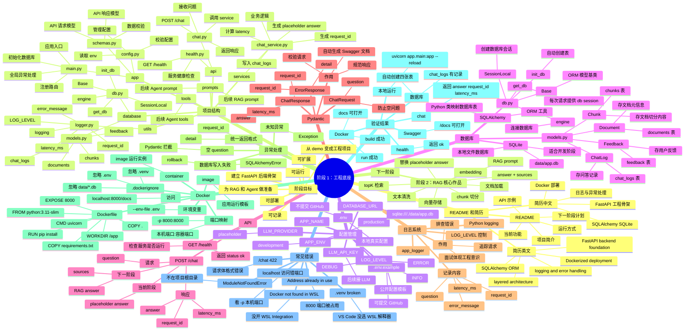

# 当前项目代码总结

生成时间：2026-05-21 20:02:10

项目名称：Enterprise RAG Agent Assistant

当前阶段：阶段 2：RAG 核心作品

---

## 1. 项目当前状态

当前项目已经从基础 FastAPI 工程升级为一个最小可运行的企业知识库 RAG 问答系统。

当前已具备：

- FastAPI 后端项目结构
- SQLite + SQLAlchemy 数据库
- documents、chunks、chat_logs、feedback 表
- 文档读取、清洗、chunk 切分
- 文档和 chunks 写入 SQLite
- EmbeddingClient 封装
- Chroma 向量库服务
- 文档索引接口 `/documents/index`
- RAG Prompt
- LLMClient 封装
- RAG 问答接口 `/chat`
- answer + sources 返回
- chat_logs 问答日志记录
- RAG 人工评测问题集

---

## 2. 当前项目文件树

```text
.dockerignore
.env.example
.gitignore
00_project_notes/stage_01_engineering_foundation.md
00_project_notes/stage_01_mindmap.md
Dockerfile
README.md
app/api/__init__.py
app/api/chat.py
app/api/documents.py
app/api/health.py
app/config.py
app/database/__init__.py
app/database/db.py
app/database/models.py
app/main.py
app/prompts/__init__.py
app/prompts/rag_prompt.py
app/schemas.py
app/services/__init__.py
app/services/chat_service.py
app/services/document_service.py
app/services/embedding_service.py
app/services/llm_service.py
app/services/rag_service.py
app/services/vector_store_service.py
app/tools/__init__.py
app/utils/__init__.py
app/utils/logger.py
data/sample_docs/company_policy.md
project_code_snapshot.txt
requirements.txt
scripts/check_chroma_data.py
scripts/generate_code_summary.py
scripts/test_embedding_service.py
scripts/test_index_document_sql.py
scripts/test_search_indexed_document.py
scripts/test_vector_store_service.py
tests/rag_eval_questions.md
```

---

## 3. 核心文件作用说明

### `.dockerignore`

项目文件。

### `.env.example`

环境变量示例文件。

### `.gitignore`

项目文件。

### `00_project_notes/stage_01_engineering_foundation.md`

项目文件。

### `00_project_notes/stage_01_mindmap.md`

项目文件。

### `Dockerfile`

Docker 镜像构建文件。

### `README.md`

项目说明文档。

### `app/api/__init__.py`

项目文件。

### `app/api/chat.py`

RAG 问答接口入口。

### `app/api/documents.py`

文档索引接口入口。

### `app/api/health.py`

健康检查接口。

### `app/config.py`

配置管理文件，负责读取 .env 中的项目配置、RAG 配置、Embedding 配置和 LLM 配置。

### `app/database/__init__.py`

项目文件。

### `app/database/db.py`

数据库连接、Session 管理和数据库初始化。

### `app/database/models.py`

SQLAlchemy ORM 模型，定义 documents、chunks、chat_logs、feedback 表。

### `app/main.py`

FastAPI 应用入口，负责创建 app、初始化数据库、注册路由和全局异常处理。

### `app/prompts/__init__.py`

项目文件。

### `app/prompts/rag_prompt.py`

RAG Prompt 构造文件，负责生成基于 context 和 question 的提示词。

### `app/schemas.py`

Pydantic 数据模型文件，定义 API 请求和响应结构。

### `app/services/__init__.py`

项目文件。

### `app/services/chat_service.py`

项目文件。

### `app/services/document_service.py`

文档处理服务，负责读取、清洗、切分、写入 SQL，并完成 RAG 索引。

### `app/services/embedding_service.py`

Embedding 客户端封装，支持 mock 和 OpenAI-compatible 结构。

### `app/services/llm_service.py`

LLM 客户端封装，支持 mock 和 OpenAI-compatible 结构。

### `app/services/rag_service.py`

RAG 问答主流程服务，串联 embedding、向量检索、prompt、LLM 和 chat_logs。

### `app/services/vector_store_service.py`

Chroma 向量库服务，负责写入 chunks 和相似度检索。

### `app/tools/__init__.py`

项目文件。

### `app/utils/__init__.py`

项目文件。

### `app/utils/logger.py`

日志工具文件，统一创建 logger。

### `data/sample_docs/company_policy.md`

项目文件。

### `project_code_snapshot.txt`

项目文件。

### `requirements.txt`

Python 依赖文件。

### `scripts/check_chroma_data.py`

项目文件。

### `scripts/generate_code_summary.py`

项目文件。

### `scripts/test_embedding_service.py`

项目文件。

### `scripts/test_index_document_sql.py`

项目文件。

### `scripts/test_search_indexed_document.py`

项目文件。

### `scripts/test_vector_store_service.py`

项目文件。

### `tests/rag_eval_questions.md`

RAG 人工评测问题集。

---

## 4. RAG 主流程总结

### 4.1 文档索引流程

```text
本地 .txt / .md 文档
↓
read_file() 读取文件
↓
clean_text() 清洗文本
↓
split_text() 切分 chunks
↓
documents / chunks 写入 SQLite
↓
EmbeddingClient 生成 chunk embeddings
↓
VectorStoreService 写入 Chroma
```

### 4.2 RAG 问答流程

```text
用户问题
↓
EmbeddingClient 生成 question embedding
↓
VectorStoreService 从 Chroma 检索 top-k chunks
↓
build_context_from_chunks() 拼接 context
↓
build_rag_prompt() 构造 RAG prompt
↓
LLMClient 生成 answer
↓
返回 answer + sources
↓
写入 chat_logs
```

---

## 5. 当前代码全文快照

下面是当前项目主要代码文件内容，用于迁移到新会话、复盘学习和让 AI 继续理解项目状态。

### FILE: `.dockerignore`

```text
.venv/
venv/
__pycache__/
*.pyc
.env
data/*.db
.git/
.vscode/
.idea/

```

### FILE: `.env.example`

```env
# =========================
# App
# =========================
APP_NAME=Enterprise RAG Agent Assistant
APP_ENV=development
LOG_LEVEL=INFO

# =========================
# Database
# =========================
DATABASE_URL=sqlite:///./data/app.db

# =========================
# RAG - Text Split
# =========================
CHUNK_SIZE=800
CHUNK_OVERLAP=120

# =========================
# RAG - Retrieval
# =========================
DEFAULT_TOP_K=3
MIN_RELEVANCE_SCORE=0.2

# =========================
# Chroma
# =========================
CHROMA_PERSIST_DIR=data/chroma_db
CHROMA_COLLECTION_NAME=enterprise_knowledge_base

# =========================
# Embedding
# =========================
EMBEDDING_PROVIDER=mock
EMBEDDING_MODEL=mock-embedding
EMBEDDING_API_KEY=
EMBEDDING_BASE_URL=

# =========================
# LLM
# =========================
LLM_PROVIDER=mock
LLM_MODEL=mock-llm
LLM_API_KEY=
LLM_BASE_URL=
```

### FILE: `.gitignore`

```text
# Python cache
__pycache__/
*.pyc
*.pyo
*.pyd

# Virtual environments
.venv/
venv/

# Environment variables
.env

# SQLite database files
*.db
data/*.db

# Logs
*.log

# IDE settings
.vscode/
.idea/

# OS files
.DS_Store
Thumbs.db

```

### FILE: `00_project_notes/stage_01_engineering_foundation.md`

```markdown
# 阶段 1：工程底座

## 1. 本阶段目标

本阶段目标是把 Enterprise RAG Agent Assistant 从一个普通 demo 搭建成一个标准、清晰、可扩展的 FastAPI AI 应用工程骨架。

本阶段不追求复杂 AI 功能，而是重点完成项目结构、配置管理、SQLite 数据库、SQLAlchemy ORM、日志、异常处理和 Docker 运行。

## 2. 完成的功能

- 创建标准 FastAPI 项目目录结构
- 实现 GET /health 健康检查接口
- 实现 POST /chat 基础聊天接口
- 使用 Pydantic 定义 ChatRequest、ChatResponse、ErrorResponse
- 使用 pydantic-settings 读取 .env 配置
- 使用 SQLite + SQLAlchemy ORM 创建数据库
- 创建 documents、chunks、chat_logs、feedback 四张表
- POST /chat 后写入 chat_logs
- 使用 Python logging 记录请求日志
- 实现基础异常处理
- 编写 Dockerfile 和 .dockerignore
- 完成本地运行和 Docker 运行验证

## 3. 新增文件和目录

```text
app/main.py
app/config.py
app/schemas.py
app/api/health.py
app/api/chat.py
app/services/chat_service.py
app/database/db.py
app/database/models.py
app/utils/logger.py
requirements.txt
Dockerfile
.dockerignore
.env.example
.gitignore
README.md
00_project_notes/stage_01_engineering_foundation.md

```

### FILE: `00_project_notes/stage_01_mindmap.md`

```markdown
# 阶段 1：工程底座思维导图



### FILE: `Dockerfile`

```dockerfile
FROM python:3.11-slim

WORKDIR /app

COPY requirements.txt .

RUN pip install --no-cache-dir -r requirements.txt

COPY . .

EXPOSE 8000

CMD ["uvicorn", "app.main:app", "--host", "0.0.0.0", "--port", "8000"]

```

### FILE: `README.md`

```markdown
# Enterprise RAG Agent Assistant

企业知识库 RAG + Agent 工作流助手。

这是一个基于 FastAPI 的 AI 应用工程项目，目标是逐步实现一个可运行、可部署、可写进简历、可用于面试讲解的企业知识库问答系统。

当前项目重点是 RAG 核心能力，后续会继续扩展 Agent 工作流、工具调用、任务路由和企业级增强能力。

---

## 当前阶段

当前阶段：阶段 2：RAG 核心作品

本阶段已经将项目从基础 FastAPI 工程，升级为一个最小可运行的企业知识库 RAG 问答系统。

当前已实现：

- FastAPI 后端项目结构
- API / Service / Database / Prompt / Utils 分层架构
- SQLite + SQLAlchemy ORM
- documents、chunks、chat_logs、feedback 表
- 支持本地 `.txt` / `.md` 文档读取
- 文本清洗
- chunk 切分
- documents / chunks 写入 SQLite
- EmbeddingClient 抽象封装
- mock embedding，用于本地工程链路测试
- OpenAI-compatible embedding 结构预留
- Chroma 向量库持久化
- 文档索引接口 `/documents/index`
- RAG Prompt 模块
- mock LLM，用于本地 RAG 流程测试
- OpenAI-compatible LLM 结构预留
- RAG 问答接口 `/chat`
- 返回 answer + sources
- 问答记录写入 chat_logs
- 人工 RAG 评测问题集
- Dockerfile 支持

---

## 项目结构

```text
enterprise-rag-agent-assistant/
├── app/
│   ├── main.py
│   ├── config.py
│   ├── schemas.py
│   ├── api/
│   │   ├── health.py
│   │   ├── chat.py
│   │   └── documents.py
│   ├── services/
│   │   ├── chat_service.py
│   │   ├── document_service.py
│   │   ├── embedding_service.py
│   │   ├── vector_store_service.py
│   │   ├── rag_service.py
│   │   └── llm_service.py
│   ├── database/
│   │   ├── db.py
│   │   └── models.py
│   ├── prompts/
│   │   └── rag_prompt.py
│   ├── tools/
│   └── utils/
│       └── logger.py
├── data/
│   ├── sample_docs/
│   │   └── company_policy.md
│   ├── chroma_db/
│   └── app.db
├── tests/
│   └── rag_eval_questions.md
├── scripts/
├── docs/
├── 00_project_notes/
├── requirements.txt
├── Dockerfile
├── .dockerignore
├── .env.example
├── .gitignore
└── README.md
```

### FILE: `app/api/__init__.py`

```python

```

### FILE: `app/api/chat.py`

```python
from fastapi import APIRouter, Depends, HTTPException
from sqlalchemy.orm import Session

from app.database.db import get_db
from app.schemas import ChatRequest, ChatResponse
from app.services.rag_service import RAGService


router = APIRouter(tags=["Chat"])

rag_service = RAGService()


@router.post("/chat", response_model=ChatResponse)
def chat(request: ChatRequest, db: Session = Depends(get_db)):
    try:
        result = rag_service.chat(
            question=request.question,
            top_k=request.top_k,
            db=db,
        )

        return ChatResponse(**result)

    except ValueError as exc:
        raise HTTPException(
            status_code=400,
            detail=str(exc),
        ) from exc

    except RuntimeError as exc:
        raise HTTPException(
            status_code=500,
            detail=str(exc),
        ) from exc

    except Exception as exc:
        raise HTTPException(
            status_code=500,
            detail="Unknown server error.",
        ) from exc
```

### FILE: `app/api/documents.py`

```python
from fastapi import APIRouter, Depends, HTTPException
from sqlalchemy.orm import Session

from app.database.db import get_db
from app.schemas import DocumentIndexRequest, DocumentIndexResponse
from app.services.document_service import index_document_for_rag


router = APIRouter(
    prefix="/documents",
    tags=["Documents"],
)


@router.post("/index", response_model=DocumentIndexResponse)
def index_document(
    request: DocumentIndexRequest,
    db: Session = Depends(get_db),
):
    """
    Index a local .txt or .md document into SQLite.

    Current stage:
    1. Read file
    2. Clean text
    3. Split into chunks
    4. Save document metadata into documents table
    5. Save chunks into chunks table

    Embedding and Chroma indexing will be added in the next steps.
    """
    try:
        result = index_document_for_rag(
    file_path=request.file_path,
    db=db,
)

        return DocumentIndexResponse(**result)

    except FileNotFoundError as exc:
        raise HTTPException(
            status_code=404,
            detail=str(exc),
        ) from exc

    except ValueError as exc:
        raise HTTPException(
            status_code=400,
            detail=str(exc),
        ) from exc

    except RuntimeError as exc:
        raise HTTPException(
            status_code=500,
            detail=str(exc),
        ) from exc

    except Exception as exc:
        raise HTTPException(
            status_code=500,
            detail="Unknown server error when indexing document.",
        ) from exc
```

### FILE: `app/api/health.py`

```python
from fastapi import APIRouter

router = APIRouter(tags=["Health"])


@router.get("/health")
def health_check():
    return {
        "status": "ok",
        "message": "Enterprise RAG Agent Assistant is running",
    }

```

### FILE: `app/config.py`

```python
from pydantic_settings import BaseSettings


class Settings(BaseSettings):
    # =========================
    # App
    # =========================
    app_name: str = "Enterprise RAG Agent Assistant"
    app_env: str = "development"
    log_level: str = "INFO"

    # =========================
    # Database
    # =========================
    database_url: str = "sqlite:///./data/app.db"

    # =========================
    # RAG - Text Split
    # =========================
    chunk_size: int = 800
    chunk_overlap: int = 120

    # =========================
    # RAG - Retrieval
    # =========================
    default_top_k: int = 3
    min_relevance_score: float = 0.2

    # =========================
    # Chroma Vector Store
    # =========================
    chroma_persist_dir: str = "data/chroma_db"
    chroma_collection_name: str = "enterprise_knowledge_base"

    # =========================
    # Embedding
    # =========================
    embedding_provider: str = "mock"
    embedding_model: str = "mock-embedding"
    embedding_api_key: str = ""
    embedding_base_url: str = ""

    # =========================
    # LLM
    # =========================
    llm_provider: str = "mock"
    llm_model: str = "mock-llm"
    llm_api_key: str = ""
    llm_base_url: str = ""

    class Config:
        env_file = ".env"
        env_file_encoding = "utf-8"


settings = Settings()


def validate_settings() -> None:
    """
    Validate important settings at application startup.

    This is intentionally lightweight for the beginner-friendly stage.
    Later we can add stricter validation for production.
    """
    if settings.chunk_overlap >= settings.chunk_size:
        raise ValueError("CHUNK_OVERLAP must be smaller than CHUNK_SIZE.")

    if settings.default_top_k <= 0:
        raise ValueError("DEFAULT_TOP_K must be greater than 0.")

    if settings.embedding_provider not in ["mock", "openai_compatible"]:
        raise ValueError("EMBEDDING_PROVIDER must be 'mock' or 'openai_compatible'.")

    if settings.llm_provider not in ["mock", "openai_compatible"]:
        raise ValueError("LLM_PROVIDER must be 'mock' or 'openai_compatible'.")
```

### FILE: `app/database/__init__.py`

```python

```

### FILE: `app/database/db.py`

```python
import os

from sqlalchemy import create_engine
from sqlalchemy.orm import declarative_base, sessionmaker

from app.config import settings


def ensure_sqlite_data_dir(database_url: str) -> None:
    """
    Ensure that the local data directory exists when using SQLite.

    Example:
    sqlite:///./data/app.db
    """
    if database_url.startswith("sqlite:///"):
        db_path = database_url.replace("sqlite:///", "")

        if db_path.startswith("./"):
            db_path = db_path[2:]

        directory = os.path.dirname(db_path)

        if directory:
            os.makedirs(directory, exist_ok=True)


ensure_sqlite_data_dir(settings.database_url)

connect_args = {}

if settings.database_url.startswith("sqlite"):
    connect_args = {"check_same_thread": False}


engine = create_engine(
    settings.database_url,
    connect_args=connect_args,
)

SessionLocal = sessionmaker(
    autocommit=False,
    autoflush=False,
    bind=engine,
)

Base = declarative_base()


def get_db():
    """
    Create and close a database session for each request.

    FastAPI will use this function as a dependency.
    """
    db = SessionLocal()
    try:
        yield db
    finally:
        db.close()


def init_db() -> None:
    """
    Create all database tables.

    In a production-level project, Alembic is usually used for database migrations.
    In this beginner-friendly engineering foundation stage, automatic table creation is enough.
    """
    from app.database import models

    Base.metadata.create_all(bind=engine)
```

### FILE: `app/database/models.py`

```python
from datetime import datetime

from sqlalchemy import Column, DateTime, ForeignKey, Integer, String, Text
from sqlalchemy.orm import relationship

from app.database.db import Base


class Document(Base):
    __tablename__ = "documents"

    id = Column(Integer, primary_key=True, index=True)
    filename = Column(String(255), nullable=False)
    file_path = Column(String(500), nullable=False)
    file_type = Column(String(50), nullable=True)
    created_at = Column(DateTime, default=datetime.utcnow)

    chunks = relationship("Chunk", back_populates="document")


class Chunk(Base):
    __tablename__ = "chunks"

    id = Column(Integer, primary_key=True, index=True)
    document_id = Column(Integer, ForeignKey("documents.id"), nullable=False)
    chunk_index = Column(Integer, nullable=False)
    content = Column(Text, nullable=False)
    created_at = Column(DateTime, default=datetime.utcnow)

    document = relationship("Document", back_populates="chunks")


class ChatLog(Base):
    __tablename__ = "chat_logs"

    id = Column(Integer, primary_key=True, index=True)
    request_id = Column(String(100), unique=True, index=True, nullable=False)

    question = Column(Text, nullable=False)
    answer = Column(Text, nullable=True)

    # For current basic chat / future Agent routing
    intent = Column(String(100), nullable=True)
    tool_used = Column(String(100), nullable=True)

    # For RAG retrieval trace
    retrieved_chunks = Column(Text, nullable=True)

    latency_ms = Column(Integer, nullable=True)
    error_message = Column(Text, nullable=True)
    created_at = Column(DateTime, default=datetime.utcnow)

    feedback_items = relationship("Feedback", back_populates="chat_log")


class Feedback(Base):
    __tablename__ = "feedback"

    id = Column(Integer, primary_key=True, index=True)
    chat_log_id = Column(Integer, ForeignKey("chat_logs.id"), nullable=False)

    rating = Column(Integer, nullable=True)
    comment = Column(Text, nullable=True)
    created_at = Column(DateTime, default=datetime.utcnow)

    chat_log = relationship("ChatLog", back_populates="feedback_items")
```

### FILE: `app/main.py`

```python
from fastapi import FastAPI, HTTPException, Request
from fastapi.exceptions import RequestValidationError
from fastapi.responses import JSONResponse

from app.api.chat import router as chat_router
from app.api.health import router as health_router
from app.config import settings, validate_settings
from app.database.db import init_db
from app.utils.logger import app_logger
from app.api.documents import router as documents_router


def create_app() -> FastAPI:
    """
    Create and configure the FastAPI application.
    """
    validate_settings()
    init_db()

    app = FastAPI(
        title=settings.app_name,
        version="0.1.0",
        description="Enterprise RAG Agent Assistant - Engineering Foundation Stage",
    )

    app.include_router(health_router)
    app.include_router(chat_router)
    app.include_router(documents_router)

    register_exception_handlers(app)

    app_logger.info(
        "Application started | app_name=%s | app_env=%s",
        settings.app_name,
        settings.app_env,
    )

    return app


def register_exception_handlers(app: FastAPI) -> None:
    """
    Register global exception handlers.

    These handlers make API error responses more consistent.
    """

    @app.exception_handler(HTTPException)
    async def http_exception_handler(request: Request, exc: HTTPException):
        app_logger.error(
            "path=%s | status_code=%s | error_message=%s",
            request.url.path,
            exc.status_code,
            exc.detail,
        )

        return JSONResponse(
            status_code=exc.status_code,
            content={
                "detail": exc.detail,
                "request_id": None,
            },
        )

    @app.exception_handler(RequestValidationError)
    async def validation_exception_handler(request: Request, exc: RequestValidationError):
        app_logger.error(
            "path=%s | status_code=%s | error_message=%s",
            request.url.path,
            422,
            str(exc),
        )

        return JSONResponse(
            status_code=422,
            content={
                "detail": "Request validation failed. Please check your input.",
                "request_id": None,
            },
        )

    @app.exception_handler(Exception)
    async def general_exception_handler(request: Request, exc: Exception):
        app_logger.error(
            "path=%s | status_code=%s | error_message=%s",
            request.url.path,
            500,
            str(exc),
        )

        return JSONResponse(
            status_code=500,
            content={
                "detail": "Internal server error.",
                "request_id": None,
            },
        )


app = create_app()
```

### FILE: `app/prompts/__init__.py`

```python

```

### FILE: `app/prompts/rag_prompt.py`

```python
from app.utils.logger import get_logger


logger = get_logger(__name__)


NO_ANSWER_TEXT = "知识库中没有找到明确答案。"


RAG_SYSTEM_INSTRUCTION = """
你是一个企业知识库问答助手。

你的任务是根据给定的企业知识库资料回答用户问题。

请严格遵守以下规则：
1. 只能根据【资料】中的内容回答。
2. 如果【资料】中没有明确答案，请回答：“知识库中没有找到明确答案。”
3. 不要编造资料中不存在的信息。
4. 不要使用你自己的外部知识补充答案。
5. 回答要简洁、清晰、直接。
6. 如果资料中包含多个相关信息，请合并后回答。
7. 不需要在回答正文中编造来源编号，具体 sources 会由程序单独返回。
""".strip()


def build_rag_prompt(context: str, question: str) -> str:
    """
    Build the final RAG prompt for the LLM.

    Args:
        context: Retrieved document chunks joined as context.
        question: User question.

    Returns:
        A complete prompt string.
    """
    cleaned_context = context.strip() if context else ""
    cleaned_question = question.strip() if question else ""

    if not cleaned_question:
        raise ValueError("question cannot be empty when building RAG prompt.")

    if not cleaned_context:
        logger.warning("Empty context when building RAG prompt.")

    prompt = f"""
{RAG_SYSTEM_INSTRUCTION}

【资料】
{cleaned_context}

【用户问题】
{cleaned_question}

请根据【资料】回答用户问题：
""".strip()

    return prompt


def build_context_from_chunks(chunks: list[dict]) -> str:
    """
    Build context text from retrieved chunks.

    Args:
        chunks:
            [
                {
                    "content": "...",
                    "filename": "company_policy.md",
                    "chunk_index": 0,
                    "distance": 0.23
                }
            ]

    Returns:
        A joined context string.
    """
    if not chunks:
        return ""

    context_parts = []

    for index, chunk in enumerate(chunks, start=1):
        filename = chunk.get("filename", "unknown")
        chunk_index = chunk.get("chunk_index", "unknown")
        content = chunk.get("content", "").strip()

        if not content:
            continue

        context_parts.append(
            f"【资料片段 {index}】\n"
            f"来源文件：{filename}\n"
            f"chunk_index：{chunk_index}\n"
            f"内容：\n{content}"
        )

    return "\n\n".join(context_parts)
```

### FILE: `app/schemas.py`

```python
from pydantic import BaseModel, Field, field_validator


class ChatRequest(BaseModel):
    question: str = Field(
        ...,
        description="User question for the RAG assistant.",
        examples=["公司的退款周期是多久？"],
    )
    top_k: int | None = Field(
        default=None,
        description="Number of retrieved chunks to use.",
        examples=[3],
    )

    @field_validator("question")
    @classmethod
    def question_must_not_be_empty(cls, value: str) -> str:
        cleaned_value = value.strip()

        if not cleaned_value:
            raise ValueError("question cannot be empty.")

        return cleaned_value

    @field_validator("top_k")
    @classmethod
    def top_k_must_be_positive(cls, value: int | None) -> int | None:
        if value is not None and value <= 0:
            raise ValueError("top_k must be greater than 0.")

        return value
    

class SourceItem(BaseModel):
    filename: str | None = Field(
        default=None,
        description="Source filename.",
        examples=["company_policy.md"],
    )
    chunk_index: int | None = Field(
        default=None,
        description="Chunk index in the source document.",
        examples=[0],
    )
    document_id: int | None = Field(
        default=None,
        description="Source document ID.",
        examples=[1],
    )
    content: str = Field(
        ...,
        description="Retrieved source content.",
        examples=["财务部门会在审核通过后的 7 个工作日内完成退款处理。"],
    )
    distance: float | None = Field(
        default=None,
        description="Vector distance returned by Chroma. Smaller usually means more similar.",
        examples=[0.23],
    )


class ChatResponse(BaseModel):
    answer: str = Field(
        ...,
        description="Assistant answer.",
        examples=["退款会在审核通过后的 7 个工作日内完成，特殊情况可能额外需要 3 到 5 个工作日。"],
    )
    sources: list[SourceItem] = Field(
        default_factory=list,
        description="Retrieved sources used for the answer.",
    )
    request_id: str = Field(
        ...,
        description="Unique request ID for tracing this chat request.",
        examples=["550e8400-e29b-41d4-a716-446655440000"],
    )
    latency_ms: int = Field(
        ...,
        description="Request latency in milliseconds.",
        examples=[123],
    )

class ErrorResponse(BaseModel):
    detail: str = Field(
        ...,
        description="Human-readable error message.",
        examples=["question cannot be empty."],
    )
    request_id: str | None = Field(
        default=None,
        description="Request ID if available.",
        examples=["550e8400-e29b-41d4-a716-446655440000"],
    )
class DocumentIndexRequest(BaseModel):
    file_path: str = Field(
        ...,
        description="Path of the document to index.",
        examples=["data/sample_docs/company_policy.md"],
    )

    @field_validator("file_path")
    @classmethod
    def file_path_must_not_be_empty(cls, value: str) -> str:
        cleaned_value = value.strip()

        if not cleaned_value:
            raise ValueError("file_path cannot be empty.")

        return cleaned_value


class DocumentIndexResponse(BaseModel):
    document_id: int = Field(
        ...,
        description="ID of the indexed document.",
        examples=[1],
    )
    filename: str = Field(
        ...,
        description="Indexed filename.",
        examples=["company_policy.md"],
    )
    chunks_count: int = Field(
        ...,
        description="Number of chunks generated from this document.",
        examples=[3],
    )
    status: str = Field(
        ...,
        description="Indexing status.",
        examples=["indexed_to_sql"],
    )
```

### FILE: `app/services/__init__.py`

```python

```

### FILE: `app/services/chat_service.py`

```python
import time
import uuid

from sqlalchemy.exc import SQLAlchemyError
from sqlalchemy.orm import Session

from app.database.models import ChatLog
from app.utils.logger import app_logger


class ChatService:
    def generate_placeholder_answer(self, question: str) -> str:
        """
        Generate a placeholder answer.

        In later stages, this method will be replaced by:
        1. RAG retrieval
        2. Prompt construction
        3. LLM generation
        4. Agent tool calling
        """
        return (
            "This is a placeholder answer. "
            "In the next stage, this endpoint will connect to the RAG pipeline."
        )

    def chat(self, question: str, db: Session) -> dict:
        request_id = str(uuid.uuid4())
        start_time = time.time()

        try:
            if not question or not question.strip():
                raise ValueError("question cannot be empty.")

            cleaned_question = question.strip()
            answer = self.generate_placeholder_answer(cleaned_question)

            latency_ms = int((time.time() - start_time) * 1000)

            chat_log = ChatLog(
                request_id=request_id,
                question=cleaned_question,
                answer=answer,
                intent="basic_chat",
                tool_used="placeholder",
                latency_ms=latency_ms,
                error_message=None,
            )

            db.add(chat_log)
            db.commit()

            app_logger.info(
                "request_id=%s | question=%s | latency_ms=%s | error_message=%s",
                request_id,
                cleaned_question,
                latency_ms,
                None,
            )

            return {
                "answer": answer,
                "request_id": request_id,
                "latency_ms": latency_ms,
            }

        except SQLAlchemyError as exc:
            db.rollback()

            latency_ms = int((time.time() - start_time) * 1000)
            error_message = f"Database write failed: {str(exc)}"

            app_logger.error(
                "request_id=%s | question=%s | latency_ms=%s | error_message=%s",
                request_id,
                question,
                latency_ms,
                error_message,
            )

            raise RuntimeError(error_message) from exc

        except Exception as exc:
            latency_ms = int((time.time() - start_time) * 1000)
            error_message = str(exc)

            app_logger.error(
                "request_id=%s | question=%s | latency_ms=%s | error_message=%s",
                request_id,
                question,
                latency_ms,
                error_message,
            )

            raise

```

### FILE: `app/services/document_service.py`

```python
from pathlib import Path
import re
from typing import Any

from sqlalchemy.exc import SQLAlchemyError
from sqlalchemy.orm import Session

from app.config import settings
from app.database.models import Chunk, Document
from app.utils.logger import get_logger
from app.services.embedding_service import EmbeddingClient
from app.services.vector_store_service import VectorStoreService


logger = get_logger(__name__)

SUPPORTED_EXTENSIONS = {".txt", ".md"}


def read_file(file_path: str) -> tuple[str, str]:
    """
    Read a .txt or .md file from the local file system.

    Args:
        file_path: Example: data/sample_docs/company_policy.md

    Returns:
        tuple:
            filename: The file name, for example company_policy.md
            raw_text: The original text content

    Raises:
        FileNotFoundError: When the file does not exist.
        ValueError: When the path is not a file, file type is unsupported, or content is empty.
        RuntimeError: When the file cannot be read correctly.
    """
    path = Path(file_path)

    if not path.exists():
        logger.error("File not found: %s", file_path)
        raise FileNotFoundError(f"File not found: {file_path}")

    if not path.is_file():
        logger.error("Path is not a file: %s", file_path)
        raise ValueError(f"Path is not a file: {file_path}")

    file_extension = path.suffix.lower()

    if file_extension not in SUPPORTED_EXTENSIONS:
        logger.error("Unsupported file type: %s", file_extension)
        raise ValueError(
            f"Unsupported file type: {file_extension}. "
            "Only .txt and .md files are supported at this stage."
        )

    try:
        raw_text = path.read_text(encoding="utf-8")
    except UnicodeDecodeError as exc:
        logger.exception("Failed to decode file as UTF-8: %s", file_path)
        raise RuntimeError(
            f"Failed to read file as UTF-8. Please check file encoding: {file_path}"
        ) from exc
    except Exception as exc:
        logger.exception("Failed to read file: %s", file_path)
        raise RuntimeError(f"Failed to read file: {file_path}") from exc

    if not raw_text.strip():
        logger.error("File content is empty: %s", file_path)
        raise ValueError(f"File content is empty: {file_path}")

    logger.info("File read successfully: %s", file_path)

    return path.name, raw_text


def clean_text(text: str) -> str:
    """
    Clean raw text for RAG indexing.

    Current cleaning strategy:
    1. Normalize line breaks.
    2. Strip leading and trailing spaces from each line.
    3. Compress too many blank lines.
    4. Keep paragraph structure.

    Important:
    Do not clean too aggressively, otherwise useful semantic structure may be lost.
    """
    if not text or not text.strip():
        return ""

    # Normalize line breaks from Windows/Mac/Linux formats.
    text = text.replace("\r\n", "\n").replace("\r", "\n")

    # Remove leading and trailing spaces for each line.
    lines = [line.strip() for line in text.split("\n")]

    # Join lines back.
    text = "\n".join(lines)

    # Compress 3 or more consecutive newlines into 2 newlines.
    # This keeps paragraph separation while removing excessive blank lines.
    text = re.sub(r"\n{3,}", "\n\n", text)

    return text.strip()


def split_text(
    text: str,
    document_id: int,
    filename: str,
    chunk_size: int | None = None,
    chunk_overlap: int | None = None,
) -> list[dict[str, Any]]:
    """
    Split cleaned text into chunks.

    Args:
        text: Cleaned text.
        document_id: The related document ID. At this step, we can temporarily use 0.
        filename: Source filename.
        chunk_size: Maximum characters per chunk.
        chunk_overlap: Overlapping characters between neighboring chunks.

    Returns:
        A list of chunk dictionaries:
        [
            {
                "content": "...",
                "chunk_index": 0,
                "metadata": {
                    "document_id": 1,
                    "filename": "company_policy.md",
                    "chunk_index": 0
                }
            }
        ]
    """
    if chunk_size is None:
        chunk_size = settings.chunk_size

    if chunk_overlap is None:
        chunk_overlap = settings.chunk_overlap

    if not text or not text.strip():
        raise ValueError("Text cannot be empty when splitting into chunks.")

    if chunk_size <= 0:
        raise ValueError("chunk_size must be greater than 0.")

    if chunk_overlap < 0:
        raise ValueError("chunk_overlap cannot be negative.")

    if chunk_overlap >= chunk_size:
        raise ValueError("chunk_overlap must be smaller than chunk_size.")

    chunks: list[dict[str, Any]] = []

    start = 0
    chunk_index = 0
    text_length = len(text)

    while start < text_length:
        end = start + chunk_size
        chunk_content = text[start:end].strip()

        if chunk_content:
            chunks.append(
                {
                    "content": chunk_content,
                    "chunk_index": chunk_index,
                    "metadata": {
                        "document_id": document_id,
                        "filename": filename,
                        "chunk_index": chunk_index,
                    },
                }
            )

            chunk_index += 1

        start += chunk_size - chunk_overlap

    logger.info(
        "Text split completed | filename=%s | document_id=%s | chunks_count=%s",
        filename,
        document_id,
        len(chunks),
    )

    return chunks


def preview_document_chunks(file_path: str) -> dict[str, Any]:
    """
    Preview the document reading, cleaning, and chunking result.

    This is a temporary helper function for Stage 2 Step 4.
    Later, /documents/index will use similar logic and then save data into:
    1. SQLite documents table
    2. SQLite chunks table
    3. Chroma vector store
    """
    filename, raw_text = read_file(file_path)
    cleaned_text = clean_text(raw_text)

    chunks = split_text(
        text=cleaned_text,
        document_id=0,
        filename=filename,
        chunk_size=settings.chunk_size,
        chunk_overlap=settings.chunk_overlap,
    )

    return {
        "filename": filename,
        "raw_text_length": len(raw_text),
        "cleaned_text_length": len(cleaned_text),
        "chunks_count": len(chunks),
        "chunks": chunks,
    }
def index_document_to_sql(file_path: str, db: Session) -> dict[str, Any]:
    """
    Index a document into SQLite.

    This function only saves data into:
    1. documents table
    2. chunks table

    It does not create embeddings or write to Chroma yet.
    Chroma indexing will be added in the next steps.

    Args:
        file_path: Example: data/sample_docs/company_policy.md
        db: SQLAlchemy database session

    Returns:
        {
            "document_id": 1,
            "filename": "company_policy.md",
            "chunks_count": 3,
            "status": "indexed_to_sql"
        }
    """
    try:
        filename, raw_text = read_file(file_path)
        cleaned_text = clean_text(raw_text)

        path = Path(file_path)

        document = Document(
            filename=filename,
            file_path=str(path),
            file_type=path.suffix.lower().replace(".", ""),
        )

        db.add(document)

        # flush 会把 document 插入数据库，但还不会最终 commit。
        # 这样我们可以先拿到 document.id，用来关联 chunks。
        db.flush()

        chunks = split_text(
            text=cleaned_text,
            document_id=document.id,
            filename=filename,
            chunk_size=settings.chunk_size,
            chunk_overlap=settings.chunk_overlap,
        )

        chunk_models = []

        for chunk in chunks:
            chunk_model = Chunk(
                document_id=document.id,
                chunk_index=chunk["chunk_index"],
                content=chunk["content"],
            )
            chunk_models.append(chunk_model)

        db.add_all(chunk_models)
        db.commit()
        db.refresh(document)

        logger.info(
            "Document indexed to SQL successfully | document_id=%s | filename=%s | chunks_count=%s",
            document.id,
            filename,
            len(chunks),
        )

        return {
            "document_id": document.id,
            "filename": filename,
            "chunks_count": len(chunks),
            "status": "indexed_to_sql",
        }

    except SQLAlchemyError as exc:
        db.rollback()

        logger.exception(
            "Database error when indexing document | file_path=%s",
            file_path,
        )

        raise RuntimeError(
            f"Database error when indexing document: {str(exc)}"
        ) from exc

    except Exception:
        db.rollback()

        logger.exception(
            "Failed to index document to SQL | file_path=%s",
            file_path,
        )

        raise
    
    
def index_document_for_rag(file_path: str, db: Session) -> dict[str, Any]:
    """
    Index a document into both SQLite and Chroma.

    Full Stage 2 indexing flow:
    1. Read local .txt / .md file
    2. Clean text
    3. Create document record in SQLite
    4. Split text into chunks
    5. Save chunks into SQLite
    6. Generate embeddings for chunks
    7. Save chunks + embeddings + metadata into Chroma
    8. Commit SQL transaction

    Args:
        file_path: Example: data/sample_docs/company_policy.md
        db: SQLAlchemy database session

    Returns:
        {
            "document_id": 1,
            "filename": "company_policy.md",
            "chunks_count": 3,
            "status": "indexed"
        }
    """
    try:
        filename, raw_text = read_file(file_path)
        cleaned_text = clean_text(raw_text)

        path = Path(file_path)

        document = Document(
            filename=filename,
            file_path=str(path),
            file_type=path.suffix.lower().replace(".", ""),
        )

        db.add(document)

        # We need document.id before creating chunks and Chroma IDs.
        db.flush()

        chunks = split_text(
            text=cleaned_text,
            document_id=document.id,
            filename=filename,
            chunk_size=settings.chunk_size,
            chunk_overlap=settings.chunk_overlap,
        )

        chunk_models = []

        for chunk in chunks:
            chunk_model = Chunk(
                document_id=document.id,
                chunk_index=chunk["chunk_index"],
                content=chunk["content"],
            )
            chunk_models.append(chunk_model)

        db.add_all(chunk_models)

        # Generate embeddings for all chunk contents.
        embedding_client = EmbeddingClient()
        chunk_texts = [chunk["content"] for chunk in chunks]
        embeddings = embedding_client.embed_texts(chunk_texts)

        # Save chunks and embeddings into Chroma.
        vector_store = VectorStoreService()
        vector_store.add_chunks(
            chunks=chunks,
            embeddings=embeddings,
        )

        db.commit()
        db.refresh(document)

        logger.info(
            "Document indexed for RAG successfully | document_id=%s | filename=%s | chunks_count=%s",
            document.id,
            filename,
            len(chunks),
        )

        return {
            "document_id": document.id,
            "filename": filename,
            "chunks_count": len(chunks),
            "status": "indexed",
        }

    except SQLAlchemyError as exc:
        db.rollback()

        logger.exception(
            "Database error when indexing document for RAG | file_path=%s",
            file_path,
        )

        raise RuntimeError(
            f"Database error when indexing document for RAG: {str(exc)}"
        ) from exc

    except Exception:
        db.rollback()

        logger.exception(
            "Failed to index document for RAG | file_path=%s",
            file_path,
        )

        raise   
```

### FILE: `app/services/embedding_service.py`

```python
import hashlib
import random
from typing import Literal

from openai import OpenAI

from app.config import settings
from app.utils.logger import get_logger


logger = get_logger(__name__)


EmbeddingProvider = Literal["mock", "openai_compatible"]


class EmbeddingClient:
    """
    A unified embedding client.

    Supported providers:
    1. mock:
       Generate deterministic fake embeddings for local development.
    2. openai_compatible:
       Use an OpenAI-compatible embeddings API.

    This class prevents embedding API calls from being scattered across business code.
    """

    def __init__(self) -> None:
        self.provider: EmbeddingProvider = settings.embedding_provider  # type: ignore
        self.model = settings.embedding_model
        self.api_key = settings.embedding_api_key
        self.base_url = settings.embedding_base_url

        self.mock_embedding_dim = 384

        if self.provider == "openai_compatible":
            if not self.api_key:
                raise ValueError(
                    "EMBEDDING_API_KEY is required when EMBEDDING_PROVIDER=openai_compatible."
                )

            if self.base_url:
                self.client = OpenAI(
                    api_key=self.api_key,
                    base_url=self.base_url,
                )
            else:
                self.client = OpenAI(api_key=self.api_key)
        else:
            self.client = None

    def embed_texts(self, texts: list[str]) -> list[list[float]]:
        """
        Convert a list of texts into embedding vectors.

        Args:
            texts: A list of text chunks.

        Returns:
            A list of embedding vectors.
        """
        if not texts:
            raise ValueError("texts cannot be empty.")

        cleaned_texts = [text.strip() for text in texts if text and text.strip()]

        if not cleaned_texts:
            raise ValueError("texts cannot contain only empty strings.")

        try:
            if self.provider == "mock":
                return self._embed_texts_mock(cleaned_texts)

            if self.provider == "openai_compatible":
                return self._embed_texts_openai_compatible(cleaned_texts)

            raise ValueError(f"Unsupported embedding provider: {self.provider}")

        except Exception:
            logger.exception(
                "Embedding failed | provider=%s | model=%s | texts_count=%s",
                self.provider,
                self.model,
                len(cleaned_texts),
            )
            raise

    def _embed_texts_mock(self, texts: list[str]) -> list[list[float]]:
        """
        Generate deterministic fake embeddings.

        Why deterministic?
        The same input text should always produce the same fake vector.
        This makes local development and testing more stable.

        Note:
        Mock embeddings are only for engineering pipeline testing.
        They do not represent real semantic similarity.
        """
        embeddings: list[list[float]] = []

        for text in texts:
            seed = self._text_to_seed(text)
            random_generator = random.Random(seed)

            vector = [
                random_generator.uniform(-1.0, 1.0)
                for _ in range(self.mock_embedding_dim)
            ]

            embeddings.append(vector)

        logger.info(
            "Mock embeddings generated | texts_count=%s | dim=%s",
            len(texts),
            self.mock_embedding_dim,
        )

        return embeddings

    def _embed_texts_openai_compatible(self, texts: list[str]) -> list[list[float]]:
        """
        Call an OpenAI-compatible embeddings API.

        Example providers may include:
        - OpenAI-compatible embedding service
        - Zhipu compatible endpoint if exposed in compatible style
        - Other vendors that support OpenAI-style embeddings API
        """
        if self.client is None:
            raise RuntimeError("OpenAI-compatible embedding client is not initialized.")

        response = self.client.embeddings.create(
            model=self.model,
            input=texts,
        )

        embeddings = [item.embedding for item in response.data]

        logger.info(
            "Embeddings generated | provider=%s | model=%s | texts_count=%s",
            self.provider,
            self.model,
            len(texts),
        )

        return embeddings

    @staticmethod
    def _text_to_seed(text: str) -> int:
        """
        Convert text to a stable integer seed using md5.

        Python's built-in hash() is not stable across different processes,
        so we use md5 for deterministic mock embeddings.
        """
        digest = hashlib.md5(text.encode("utf-8")).hexdigest()
        return int(digest[:8], 16)
```

### FILE: `app/services/llm_service.py`

```python
from typing import Literal

from openai import OpenAI

from app.config import settings
from app.prompts.rag_prompt import NO_ANSWER_TEXT
from app.utils.logger import get_logger


logger = get_logger(__name__)


LLMProvider = Literal["mock", "openai_compatible"]


class LLMClient:
    """
    Unified LLM client.

    Supported providers:
    1. mock:
       Local mock answer for pipeline testing.
    2. openai_compatible:
       OpenAI-compatible chat completions API.
    """

    def __init__(self) -> None:
        self.provider: LLMProvider = settings.llm_provider  # type: ignore
        self.model = settings.llm_model
        self.api_key = settings.llm_api_key
        self.base_url = settings.llm_base_url

        if self.provider == "openai_compatible":
            if not self.api_key:
                raise ValueError(
                    "LLM_API_KEY is required when LLM_PROVIDER=openai_compatible."
                )

            if self.base_url:
                self.client = OpenAI(
                    api_key=self.api_key,
                    base_url=self.base_url,
                )
            else:
                self.client = OpenAI(api_key=self.api_key)
        else:
            self.client = None

    def generate_answer(self, prompt: str) -> str:
        """
        Generate answer from a RAG prompt.
        """
        if not prompt or not prompt.strip():
            raise ValueError("prompt cannot be empty.")

        try:
            if self.provider == "mock":
                return self._generate_answer_mock(prompt)

            if self.provider == "openai_compatible":
                return self._generate_answer_openai_compatible(prompt)

            raise ValueError(f"Unsupported LLM provider: {self.provider}")

        except Exception:
            logger.exception(
                "LLM generation failed | provider=%s | model=%s",
                self.provider,
                self.model,
            )
            raise

    def _generate_answer_mock(self, prompt: str) -> str:
        """
        Mock LLM answer.

        Important:
        The mock LLM does not really understand language.
        So we manually check the user question section first,
        then decide whether the retrieved context can answer it.
        """
        logger.info("Mock LLM generated answer.")

        question = self._extract_question_from_prompt(prompt)

        if any(keyword in question for keyword in ["退款", "退钱", "多久到账", "退款周期"]):
            if "7 个工作日" in prompt and "退款" in prompt:
                return (
                    "根据知识库资料，如果退款申请符合公司政策，"
                    "财务部门会在审核通过后的 7 个工作日内完成退款处理。"
                    "特殊情况可能需要额外 3 到 5 个工作日。"
                )

        if any(keyword in question for keyword in ["远程办公", "居家办公", "在家办公"]):
            if "每周最多可以申请 2 天远程办公" in prompt:
                return "根据知识库资料，员工每周最多可以申请 2 天远程办公，并且需要提前一天向直属主管申请。"

        if any(keyword in question for keyword in ["发票", "开票"]):
            if "30 天内申请发票" in prompt:
                return "根据知识库资料，客户可以在订单完成后的 30 天内申请发票，并需要提供公司名称、税号、订单编号和联系人邮箱。"

        if any(keyword in question for keyword in ["客服", "响应时间", "多久回复"]):
            if "普通问题的客服响应时间为 24 小时内" in prompt:
                return "根据知识库资料，普通问题的客服响应时间为 24 小时内，紧急问题应在 4 小时内响应。"

        if any(keyword in question for keyword in ["数据安全", "客户信息", "客户资料", "个人设备"]):
            if "客户信息仅允许授权员工访问" in prompt:
                return "根据知识库资料，公司内部知识库中的客户信息仅允许授权员工访问，员工不得将客户资料复制到个人设备或第三方平台。"

        return NO_ANSWER_TEXT

    def _extract_question_from_prompt(self, prompt: str) -> str:
        """
        Extract user question from the RAG prompt.
        """
        marker = "【用户问题】"

        if marker not in prompt:
            return ""

        question_part = prompt.split(marker, 1)[1]

        end_marker = "请根据【资料】回答用户问题："

        if end_marker in question_part:
            question_part = question_part.split(end_marker, 1)[0]

        return question_part.strip()

    def _generate_answer_openai_compatible(self, prompt: str) -> str:
        """
        Call an OpenAI-compatible chat completions API.
        """
        if self.client is None:
            raise RuntimeError("OpenAI-compatible LLM client is not initialized.")

        response = self.client.chat.completions.create(
            model=self.model,
            messages=[
                {
                    "role": "user",
                    "content": prompt,
                }
            ],
            temperature=0.2,
        )

        answer = response.choices[0].message.content

        if not answer:
            return NO_ANSWER_TEXT

        logger.info(
            "LLM answer generated | provider=%s | model=%s",
            self.provider,
            self.model,
        )

        return answer.strip()
```

### FILE: `app/services/rag_service.py`

```python
import json
import time
import uuid
from typing import Any

from sqlalchemy.exc import SQLAlchemyError
from sqlalchemy.orm import Session

from app.config import settings
from app.database.models import ChatLog
from app.prompts.rag_prompt import (
    NO_ANSWER_TEXT,
    build_context_from_chunks,
    build_rag_prompt,
)
from app.services.embedding_service import EmbeddingClient
from app.services.llm_service import LLMClient
from app.services.vector_store_service import VectorStoreService
from app.utils.logger import get_logger


logger = get_logger(__name__)


class RAGService:
    """
    RAG question-answering service.

    Full flow:
    1. Validate question
    2. Embed question
    3. Retrieve top-k chunks from Chroma
    4. Build context
    5. Build RAG prompt
    6. Generate answer with LLM
    7. Save chat log
    8. Return answer + sources
    """

    def __init__(self) -> None:
        self.embedding_client = EmbeddingClient()
        self.vector_store = VectorStoreService()
        self.llm_client = LLMClient()

    def chat(
        self,
        question: str,
        db: Session,
        top_k: int | None = None,
    ) -> dict[str, Any]:
        request_id = str(uuid.uuid4())
        start_time = time.time()

        cleaned_question = question.strip() if question else ""

        if not cleaned_question:
            raise ValueError("question cannot be empty.")

        if top_k is None:
            top_k = settings.default_top_k

        try:
            query_embedding = self.embedding_client.embed_texts([cleaned_question])[0]

            retrieved_chunks = self.vector_store.search_similar_chunks(
                query_embedding=query_embedding,
                top_k=top_k,
            )

            if not retrieved_chunks:
                answer = NO_ANSWER_TEXT
                sources = []
            else:
                context = build_context_from_chunks(retrieved_chunks)
                prompt = build_rag_prompt(
                    context=context,
                    question=cleaned_question,
                )

                answer = self.llm_client.generate_answer(prompt)
                sources = self._build_sources(retrieved_chunks)

            latency_ms = int((time.time() - start_time) * 1000)

            self._save_chat_log(
                db=db,
                request_id=request_id,
                question=cleaned_question,
                answer=answer,
                retrieved_chunks=sources,
                latency_ms=latency_ms,
                error_message=None,
            )

            logger.info(
                "RAG chat completed | request_id=%s | top_k=%s | retrieved_chunks=%s | latency_ms=%s",
                request_id,
                top_k,
                len(sources),
                latency_ms,
            )

            return {
                "answer": answer,
                "sources": sources,
                "request_id": request_id,
                "latency_ms": latency_ms,
            }

        except ValueError as exc:
            latency_ms = int((time.time() - start_time) * 1000)

            self._save_chat_log_safely(
                db=db,
                request_id=request_id,
                question=cleaned_question,
                answer=None,
                retrieved_chunks=[],
                latency_ms=latency_ms,
                error_message=str(exc),
            )

            logger.warning(
                "RAG chat value error | request_id=%s | error_message=%s",
                request_id,
                str(exc),
            )

            raise

        except Exception as exc:
            latency_ms = int((time.time() - start_time) * 1000)

            self._save_chat_log_safely(
                db=db,
                request_id=request_id,
                question=cleaned_question,
                answer=None,
                retrieved_chunks=[],
                latency_ms=latency_ms,
                error_message=str(exc),
            )

            logger.exception(
                "RAG chat failed | request_id=%s | error_message=%s",
                request_id,
                str(exc),
            )

            raise RuntimeError(f"RAG chat failed: {str(exc)}") from exc

    def _build_sources(self, retrieved_chunks: list[dict[str, Any]]) -> list[dict[str, Any]]:
        """
        Convert retrieved chunks into API sources.
        """
        sources = []

        for chunk in retrieved_chunks:
            sources.append(
                {
                    "filename": chunk.get("filename"),
                    "chunk_index": chunk.get("chunk_index"),
                    "document_id": chunk.get("document_id"),
                    "content": chunk.get("content", ""),
                    "distance": chunk.get("distance"),
                }
            )

        return sources

    def _save_chat_log(
        self,
        db: Session,
        request_id: str,
        question: str,
        answer: str | None,
        retrieved_chunks: list[dict[str, Any]],
        latency_ms: int,
        error_message: str | None,
    ) -> None:
        """
        Save chat log into SQLite.
        """
        chat_log = ChatLog(
            request_id=request_id,
            question=question,
            answer=answer,
            intent="rag_chat",
            tool_used="vector_search",
            retrieved_chunks=json.dumps(
                retrieved_chunks,
                ensure_ascii=False,
            ),
            latency_ms=latency_ms,
            error_message=error_message,
        )

        db.add(chat_log)
        db.commit()

    def _save_chat_log_safely(
        self,
        db: Session,
        request_id: str,
        question: str,
        answer: str | None,
        retrieved_chunks: list[dict[str, Any]],
        latency_ms: int,
        error_message: str | None,
    ) -> None:
        """
        Save chat log safely even when main RAG flow fails.
        """
        try:
            self._save_chat_log(
                db=db,
                request_id=request_id,
                question=question,
                answer=answer,
                retrieved_chunks=retrieved_chunks,
                latency_ms=latency_ms,
                error_message=error_message,
            )
        except SQLAlchemyError:
            db.rollback()
            logger.exception(
                "Failed to save error chat log | request_id=%s",
                request_id,
            )
```

### FILE: `app/services/vector_store_service.py`

```python
from typing import Any

import chromadb

from app.config import settings
from app.utils.logger import get_logger


logger = get_logger(__name__)


class VectorStoreService:
    """
    Chroma vector store service.

    Responsibilities:
    1. Initialize persistent Chroma client.
    2. Create or get collection.
    3. Add chunk embeddings.
    4. Search similar chunks by query embedding.
    """

    def __init__(self) -> None:
        self.persist_dir = settings.chroma_persist_dir
        self.collection_name = settings.chroma_collection_name

        self.client = chromadb.PersistentClient(path=self.persist_dir)

        self.collection = self.client.get_or_create_collection(
            name=self.collection_name,
            metadata={
                "description": "Enterprise knowledge base chunks for RAG",
            },
        )

        logger.info(
            "Chroma vector store initialized | persist_dir=%s | collection=%s",
            self.persist_dir,
            self.collection_name,
        )

    def add_chunks(
        self,
        chunks: list[dict[str, Any]],
        embeddings: list[list[float]],
    ) -> dict[str, Any]:
        """
        Add chunks and their embeddings into Chroma.

        Args:
            chunks:
                [
                    {
                        "content": "...",
                        "chunk_index": 0,
                        "metadata": {
                            "document_id": 1,
                            "filename": "company_policy.md",
                            "chunk_index": 0
                        }
                    }
                ]

            embeddings:
                [
                    [0.1, 0.2, ...],
                    [0.3, 0.4, ...]
                ]

        Returns:
            {
                "added_count": 3,
                "collection_name": "enterprise_knowledge_base"
            }
        """
        if not chunks:
            raise ValueError("chunks cannot be empty.")

        if not embeddings:
            raise ValueError("embeddings cannot be empty.")

        if len(chunks) != len(embeddings):
            raise ValueError(
                f"chunks and embeddings length mismatch: "
                f"chunks={len(chunks)}, embeddings={len(embeddings)}"
            )

        ids: list[str] = []
        documents: list[str] = []
        metadatas: list[dict[str, Any]] = []

        for chunk in chunks:
            metadata = chunk.get("metadata", {})

            document_id = metadata.get("document_id")
            filename = metadata.get("filename")
            chunk_index = metadata.get("chunk_index")

            if document_id is None or filename is None or chunk_index is None:
                raise ValueError(
                    "Each chunk metadata must contain document_id, filename, and chunk_index."
                )

            chunk_id = f"doc_{document_id}_chunk_{chunk_index}"

            ids.append(chunk_id)
            documents.append(chunk["content"])
            metadatas.append(
                {
                    "document_id": int(document_id),
                    "filename": str(filename),
                    "chunk_index": int(chunk_index),
                }
            )

        self.collection.add(
            ids=ids,
            documents=documents,
            embeddings=embeddings,
            metadatas=metadatas,
        )

        logger.info(
            "Chunks added to Chroma | collection=%s | added_count=%s",
            self.collection_name,
            len(chunks),
        )

        return {
            "added_count": len(chunks),
            "collection_name": self.collection_name,
        }

    def search_similar_chunks(
        self,
        query_embedding: list[float],
        top_k: int | None = None,
    ) -> list[dict[str, Any]]:
        """
        Search similar chunks by query embedding.

        Args:
            query_embedding: Embedding vector of the user question.
            top_k: Number of results to return.

        Returns:
            [
                {
                    "content": "...",
                    "filename": "company_policy.md",
                    "chunk_index": 0,
                    "document_id": 1,
                    "distance": 0.23
                }
            ]
        """
        if top_k is None:
            top_k = settings.default_top_k

        if top_k <= 0:
            raise ValueError("top_k must be greater than 0.")

        if not query_embedding:
            raise ValueError("query_embedding cannot be empty.")

        collection_count = self.collection.count()

        if collection_count == 0:
            raise ValueError("Vector store is empty. Please index documents first.")

        n_results = min(top_k, collection_count)

        result = self.collection.query(
            query_embeddings=[query_embedding],
            n_results=n_results,
            include=["documents", "metadatas", "distances"],
        )

        documents = result.get("documents", [[]])[0]
        metadatas = result.get("metadatas", [[]])[0]
        distances = result.get("distances", [[]])[0]

        search_results: list[dict[str, Any]] = []

        for content, metadata, distance in zip(documents, metadatas, distances):
            search_results.append(
                {
                    "content": content,
                    "filename": metadata.get("filename"),
                    "chunk_index": metadata.get("chunk_index"),
                    "document_id": metadata.get("document_id"),
                    "distance": distance,
                }
            )

        logger.info(
            "Chroma search completed | collection=%s | top_k=%s | returned=%s",
            self.collection_name,
            top_k,
            len(search_results),
        )

        return search_results

    def count(self) -> int:
        """
        Return number of records in the Chroma collection.
        """
        return self.collection.count()
```

### FILE: `app/tools/__init__.py`

```python

```

### FILE: `app/utils/__init__.py`

```python

```

### FILE: `app/utils/logger.py`

```python
import logging
import sys

from app.config import settings


def get_logger(name: str = "enterprise_rag_agent_assistant") -> logging.Logger:
    """
    Create and return a configured logger.

    The log level is controlled by LOG_LEVEL in .env.
    """
    logger = logging.getLogger(name)

    if logger.handlers:
        return logger

    log_level = getattr(logging, settings.log_level.upper(), logging.INFO)
    logger.setLevel(log_level)

    handler = logging.StreamHandler(sys.stdout)
    handler.setLevel(log_level)

    formatter = logging.Formatter(
        fmt="%(asctime)s | %(levelname)s | %(name)s | %(message)s",
        datefmt="%Y-%m-%d %H:%M:%S",
    )

    handler.setFormatter(formatter)
    logger.addHandler(handler)

    logger.propagate = False

    return logger


app_logger = get_logger()
```

### FILE: `data/sample_docs/company_policy.md`

```markdown
# 公司员工服务政策

## 退款政策

客户提交退款申请后，客服团队会在 2 个工作日内完成初步审核。

如果退款申请符合公司政策，财务部门会在审核通过后的 7 个工作日内完成退款处理。

特殊情况可能需要额外 3 到 5 个工作日。

## 客服响应时间

普通问题的客服响应时间为 24 小时内。

紧急问题应在 4 小时内响应。

## 发票政策

客户可以在订单完成后的 30 天内申请发票。

发票申请需要提供公司名称、税号、订单编号和联系人邮箱。

## 数据安全政策

公司内部知识库中的客户信息仅允许授权员工访问。

员工不得将客户资料复制到个人设备或第三方平台。

## 远程办公政策

员工每周最多可以申请 2 天远程办公。

远程办公需要提前一天向直属主管申请。
```

### FILE: `project_code_snapshot.txt`

```text


===== FILE: ./.dockerignore =====

.venv/
venv/
__pycache__/
*.pyc
.env
data/*.db
.git/
.vscode/
.idea/


===== FILE: ./.env.example =====

# =========================
# App
# =========================
APP_NAME=Enterprise RAG Agent Assistant
APP_ENV=development
LOG_LEVEL=INFO

# =========================
# Database
# =========================
DATABASE_URL=sqlite:///./data/app.db

# =========================
# RAG - Text Split
# =========================
CHUNK_SIZE=800
CHUNK_OVERLAP=120

# =========================
# RAG - Retrieval
# =========================
DEFAULT_TOP_K=3
MIN_RELEVANCE_SCORE=0.2

# =========================
# Chroma
# =========================
CHROMA_PERSIST_DIR=data/chroma_db
CHROMA_COLLECTION_NAME=enterprise_knowledge_base

# =========================
# Embedding
# =========================
EMBEDDING_PROVIDER=mock
EMBEDDING_MODEL=mock-embedding
EMBEDDING_API_KEY=
EMBEDDING_BASE_URL=

# =========================
# LLM
# =========================
LLM_PROVIDER=mock
LLM_MODEL=mock-llm
LLM_API_KEY=
LLM_BASE_URL=

===== FILE: ./.gitignore =====

# Python cache
__pycache__/
*.pyc
*.pyo
*.pyd

# Virtual environments
.venv/
venv/

# Environment variables
.env

# SQLite database files
*.db
data/*.db

# Logs
*.log

# IDE settings
.vscode/
.idea/

# OS files
.DS_Store
Thumbs.db


===== FILE: ./00_project_notes/stage_01_engineering_foundation.md =====

# 阶段 1：工程底座

## 1. 本阶段目标

本阶段目标是把 Enterprise RAG Agent Assistant 从一个普通 demo 搭建成一个标准、清晰、可扩展的 FastAPI AI 应用工程骨架。

本阶段不追求复杂 AI 功能，而是重点完成项目结构、配置管理、SQLite 数据库、SQLAlchemy ORM、日志、异常处理和 Docker 运行。

## 2. 完成的功能

- 创建标准 FastAPI 项目目录结构
- 实现 GET /health 健康检查接口
- 实现 POST /chat 基础聊天接口
- 使用 Pydantic 定义 ChatRequest、ChatResponse、ErrorResponse
- 使用 pydantic-settings 读取 .env 配置
- 使用 SQLite + SQLAlchemy ORM 创建数据库
- 创建 documents、chunks、chat_logs、feedback 四张表
- POST /chat 后写入 chat_logs
- 使用 Python logging 记录请求日志
- 实现基础异常处理
- 编写 Dockerfile 和 .dockerignore
- 完成本地运行和 Docker 运行验证

## 3. 新增文件和目录

```text
app/main.py
app/config.py
app/schemas.py
app/api/health.py
app/api/chat.py
app/services/chat_service.py
app/database/db.py
app/database/models.py
app/utils/logger.py
requirements.txt
Dockerfile
.dockerignore
.env.example
.gitignore
README.md
00_project_notes/stage_01_engineering_foundation.md


===== FILE: ./00_project_notes/stage_01_mindmap.md =====

# 阶段 1：工程底座思维导图

```mermaid
mindmap
  root((阶段 1：工程底座))
    阶段目标
      从 demo 变成工程项目
      建立 FastAPI 后端骨架
      为 RAG 和 Agent 做准备
      可运行
      可记录
      可部署
      可扩展

    项目结构
      app
        main.py
          应用入口
          注册路由
          初始化数据库
          全局异常处理
        config.py
          读取 env
          管理配置
          校验配置
        schemas.py
          API 请求模型
          API 响应模型
          数据校验
      api
        health.py
          GET /health
          服务健康检查
        chat.py
          POST /chat
          接收问题
          调用 service
          返回响应
      services
        chat_service.py
          业务逻辑
          生成 request_id
          生成 placeholder answer
          计算 latency
          写入 chat_logs
      database
        db.py
          engine
          SessionLocal
          Base
          get_db
          init_db
        models.py
          documents
          chunks
          chat_logs
          feedback
      utils
        logger.py
          logging
          LOG_LEVEL
          request_id
          latency_ms
          error_message
      prompts
        后续 RAG prompt
        后续 Agent prompt
      tools
        后续 Agent tools

    配置管理
      .env.example
        公开配置模板
        可提交 GitHub
      .env
        本地真实配置
        不提交 GitHub
      APP_NAME
      APP_ENV
        development
        production
      DATABASE_URL
        sqlite:///./data/app.db
      LLM_PROVIDER
        placeholder
      LLM_API_KEY
        后续接 LLM
      LOG_LEVEL
        INFO
        DEBUG
        ERROR

    数据库
      SQLite
        本地文件数据库
        data/app.db
        适合开发阶段
      SQLAlchemy
        ORM 工具
        Python 类映射数据库表
      db.py
        engine
          连接数据库
        SessionLocal
          创建数据库会话
        Base
          ORM 模型基类
        get_db
          每次请求提供 db session
        init_db
          自动创建表
      models.py
        Document
          documents 表
          存文档元信息
        Chunk
          chunks 表
          存文档切分内容
        ChatLog
          chat_logs 表
          存问答记录
        Feedback
          feedback 表
          存用户反馈

    API
      GET /health
        检查服务是否运行
        返回 status ok
      POST /chat
        请求
          question
        响应
          answer
          request_id
          latency_ms
        当前阶段
          placeholder answer
        下一阶段
          RAG answer
          sources

    Pydantic
      ChatRequest
        question
        防止空问题
      ChatResponse
        answer
        request_id
        latency_ms
      ErrorResponse
        detail
        request_id
      作用
        校验请求
        规范响应
        自动生成 Swagger 文档

    日志系统
      Python logging
      app_logger
      LOG_LEVEL 控制
      记录内容
        request_id
        question
        latency_ms
        error_message
      作用
        排查错误
        追踪请求
        面试体现工程意识

    异常处理
      空 question
        Pydantic 拦截
      数据库写入失败
        SQLAlchemyError
        rollback
      未知异常
        Exception
      统一返回格式
        detail
        request_id

    Docker
      Dockerfile
        FROM python:3.11-slim
        WORKDIR /app
        COPY requirements.txt
        RUN pip install
        COPY .
        EXPOSE 8000
        CMD uvicorn
      .dockerignore
        忽略 .venv
        忽略 .env
        忽略 data/*.db
      image
        应用运行模板
      container
        image 运行实例
      端口映射
        -p 8000:8000
        本机端口:容器端口
      环境变量
        --env-file .env
      访问
        localhost:8000/docs

    验证结果
      本地运行
        uvicorn app.main:app --reload
      Swagger
        /docs 可打开
      health
        返回 ok
      chat
        返回 answer request_id latency_ms
      数据库
        自动创建四张表
        chat_logs 有记录
      Docker
        build 成功
        run 成功
        docs 可打开

    常见错误
      ModuleNotFoundError
        不在项目根目录
      .venv broken
        VS Code 没选 WSL 解释器
      Address already in use
        8000 端口被占用
      Docker not found in WSL
        没开 WSL Integration
      /chat 422
        请求体格式错误
      localhost 访问错端口
        看 -p 本机端口

    README 和简历
      README
        项目简介
        当前功能
        运行方式
        API 示例
        下一阶段计划
      简历中文
        FastAPI 工程骨架
        SQLAlchemy SQLite
        日志与异常处理
        Docker 部署
      简历英文
        FastAPI backend foundation
        layered architecture
        SQLAlchemy ORM
        logging and error handling
        Dockerized deployment

    下一阶段
      阶段 2：RAG 核心作品
        文档加载
        文本清洗
        chunk 切分
        embedding
        向量存储
        topK 检索
        RAG prompt
        answer + sources
        替换 placeholder answer

===== FILE: ./app/api/chat.py =====

from fastapi import APIRouter, Depends, HTTPException
from sqlalchemy.orm import Session

from app.database.db import get_db
from app.schemas import ChatRequest, ChatResponse
from app.services.chat_service import ChatService

router = APIRouter(tags=["Chat"])

chat_service = ChatService()


@router.post("/chat", response_model=ChatResponse)
def chat(request: ChatRequest, db: Session = Depends(get_db)):
    try:
        result = chat_service.chat(
            question=request.question,
            db=db,
        )

        return ChatResponse(**result)

    except ValueError as exc:
        raise HTTPException(
            status_code=400,
            detail=str(exc),
        ) from exc

    except RuntimeError as exc:
        raise HTTPException(
            status_code=500,
            detail=str(exc),
        ) from exc

    except Exception as exc:
        raise HTTPException(
            status_code=500,
            detail="Unknown server error.",
        ) from exc


===== FILE: ./app/api/documents.py =====


===== FILE: ./app/api/health.py =====

from fastapi import APIRouter

router = APIRouter(tags=["Health"])


@router.get("/health")
def health_check():
    return {
        "status": "ok",
        "message": "Enterprise RAG Agent Assistant is running",
    }


===== FILE: ./app/api/__init__.py =====


===== FILE: ./app/config.py =====

from pydantic_settings import BaseSettings


class Settings(BaseSettings):
    # =========================
    # App
    # =========================
    app_name: str = "Enterprise RAG Agent Assistant"
    app_env: str = "development"
    log_level: str = "INFO"

    # =========================
    # Database
    # =========================
    database_url: str = "sqlite:///./data/app.db"

    # =========================
    # RAG - Text Split
    # =========================
    chunk_size: int = 800
    chunk_overlap: int = 120

    # =========================
    # RAG - Retrieval
    # =========================
    default_top_k: int = 3
    min_relevance_score: float = 0.2

    # =========================
    # Chroma Vector Store
    # =========================
    chroma_persist_dir: str = "data/chroma_db"
    chroma_collection_name: str = "enterprise_knowledge_base"

    # =========================
    # Embedding
    # =========================
    embedding_provider: str = "mock"
    embedding_model: str = "mock-embedding"
    embedding_api_key: str = ""
    embedding_base_url: str = ""

    # =========================
    # LLM
    # =========================
    llm_provider: str = "mock"
    llm_model: str = "mock-llm"
    llm_api_key: str = ""
    llm_base_url: str = ""

    class Config:
        env_file = ".env"
        env_file_encoding = "utf-8"


settings = Settings()


def validate_settings() -> None:
    """
    Validate important settings at application startup.

    This is intentionally lightweight for the beginner-friendly stage.
    Later we can add stricter validation for production.
    """
    if settings.chunk_overlap >= settings.chunk_size:
        raise ValueError("CHUNK_OVERLAP must be smaller than CHUNK_SIZE.")

    if settings.default_top_k <= 0:
        raise ValueError("DEFAULT_TOP_K must be greater than 0.")

    if settings.embedding_provider not in ["mock", "openai_compatible"]:
        raise ValueError("EMBEDDING_PROVIDER must be 'mock' or 'openai_compatible'.")

    if settings.llm_provider not in ["mock", "openai_compatible"]:
        raise ValueError("LLM_PROVIDER must be 'mock' or 'openai_compatible'.")

===== FILE: ./app/database/db.py =====

import os

from sqlalchemy import create_engine
from sqlalchemy.orm import declarative_base, sessionmaker

from app.config import settings


def ensure_sqlite_data_dir(database_url: str) -> None:
    """
    Ensure that the local data directory exists when using SQLite.

    Example:
    sqlite:///./data/app.db
    """
    if database_url.startswith("sqlite:///"):
        db_path = database_url.replace("sqlite:///", "")

        if db_path.startswith("./"):
            db_path = db_path[2:]

        directory = os.path.dirname(db_path)

        if directory:
            os.makedirs(directory, exist_ok=True)


ensure_sqlite_data_dir(settings.database_url)

connect_args = {}

if settings.database_url.startswith("sqlite"):
    connect_args = {"check_same_thread": False}


engine = create_engine(
    settings.database_url,
    connect_args=connect_args,
)

SessionLocal = sessionmaker(
    autocommit=False,
    autoflush=False,
    bind=engine,
)

Base = declarative_base()


def get_db():
    """
    Create and close a database session for each request.

    FastAPI will use this function as a dependency.
    """
    db = SessionLocal()
    try:
        yield db
    finally:
        db.close()


def init_db() -> None:
    """
    Create all database tables.

    In a production-level project, Alembic is usually used for database migrations.
    In this beginner-friendly engineering foundation stage, automatic table creation is enough.
    """
    from app.database import models

    Base.metadata.create_all(bind=engine)

===== FILE: ./app/database/models.py =====

from datetime import datetime

from sqlalchemy import Column, DateTime, ForeignKey, Integer, String, Text
from sqlalchemy.orm import relationship

from app.database.db import Base


class Document(Base):
    __tablename__ = "documents"

    id = Column(Integer, primary_key=True, index=True)
    filename = Column(String(255), nullable=False)
    file_path = Column(String(500), nullable=False)
    file_type = Column(String(50), nullable=True)
    created_at = Column(DateTime, default=datetime.utcnow)

    chunks = relationship("Chunk", back_populates="document")


class Chunk(Base):
    __tablename__ = "chunks"

    id = Column(Integer, primary_key=True, index=True)
    document_id = Column(Integer, ForeignKey("documents.id"), nullable=False)
    chunk_index = Column(Integer, nullable=False)
    content = Column(Text, nullable=False)
    created_at = Column(DateTime, default=datetime.utcnow)

    document = relationship("Document", back_populates="chunks")


class ChatLog(Base):
    __tablename__ = "chat_logs"

    id = Column(Integer, primary_key=True, index=True)
    request_id = Column(String(100), unique=True, index=True, nullable=False)

    question = Column(Text, nullable=False)
    answer = Column(Text, nullable=True)

    # For current basic chat / future Agent routing
    intent = Column(String(100), nullable=True)
    tool_used = Column(String(100), nullable=True)

    # For RAG retrieval trace
    retrieved_chunks = Column(Text, nullable=True)

    latency_ms = Column(Integer, nullable=True)
    error_message = Column(Text, nullable=True)
    created_at = Column(DateTime, default=datetime.utcnow)

    feedback_items = relationship("Feedback", back_populates="chat_log")


class Feedback(Base):
    __tablename__ = "feedback"

    id = Column(Integer, primary_key=True, index=True)
    chat_log_id = Column(Integer, ForeignKey("chat_logs.id"), nullable=False)

    rating = Column(Integer, nullable=True)
    comment = Column(Text, nullable=True)
    created_at = Column(DateTime, default=datetime.utcnow)

    chat_log = relationship("ChatLog", back_populates="feedback_items")

===== FILE: ./app/database/__init__.py =====


===== FILE: ./app/main.py =====

from fastapi import FastAPI, HTTPException, Request
from fastapi.exceptions import RequestValidationError
from fastapi.responses import JSONResponse

from app.api.chat import router as chat_router
from app.api.health import router as health_router
from app.config import settings, validate_settings
from app.database.db import init_db
from app.utils.logger import app_logger


def create_app() -> FastAPI:
    """
    Create and configure the FastAPI application.
    """
    validate_settings()
    init_db()

    app = FastAPI(
        title=settings.app_name,
        version="0.1.0",
        description="Enterprise RAG Agent Assistant - Engineering Foundation Stage",
    )

    app.include_router(health_router)
    app.include_router(chat_router)

    register_exception_handlers(app)

    app_logger.info(
        "Application started | app_name=%s | app_env=%s",
        settings.app_name,
        settings.app_env,
    )

    return app


def register_exception_handlers(app: FastAPI) -> None:
    """
    Register global exception handlers.

    These handlers make API error responses more consistent.
    """

    @app.exception_handler(HTTPException)
    async def http_exception_handler(request: Request, exc: HTTPException):
        app_logger.error(
            "path=%s | status_code=%s | error_message=%s",
            request.url.path,
            exc.status_code,
            exc.detail,
        )

        return JSONResponse(
            status_code=exc.status_code,
            content={
                "detail": exc.detail,
                "request_id": None,
            },
        )

    @app.exception_handler(RequestValidationError)
    async def validation_exception_handler(request: Request, exc: RequestValidationError):
        app_logger.error(
            "path=%s | status_code=%s | error_message=%s",
            request.url.path,
            422,
            str(exc),
        )

        return JSONResponse(
            status_code=422,
            content={
                "detail": "Request validation failed. Please check your input.",
                "request_id": None,
            },
        )

    @app.exception_handler(Exception)
    async def general_exception_handler(request: Request, exc: Exception):
        app_logger.error(
            "path=%s | status_code=%s | error_message=%s",
            request.url.path,
            500,
            str(exc),
        )

        return JSONResponse(
            status_code=500,
            content={
                "detail": "Internal server error.",
                "request_id": None,
            },
        )


app = create_app()

===== FILE: ./app/prompts/rag_prompt.py =====


===== FILE: ./app/prompts/__init__.py =====


===== FILE: ./app/schemas.py =====

from pydantic import BaseModel, Field, field_validator


class ChatRequest(BaseModel):
    question: str = Field(
        ...,
        description="User question for the assistant.",
        examples=["What is this project?"],
    )

    @field_validator("question")
    @classmethod
    def question_must_not_be_empty(cls, value: str) -> str:
        cleaned_value = value.strip()

        if not cleaned_value:
            raise ValueError("question cannot be empty.")

        return cleaned_value


class ChatResponse(BaseModel):
    answer: str = Field(
        ...,
        description="Assistant answer.",
        examples=["This is a placeholder answer."],
    )
    request_id: str = Field(
        ...,
        description="Unique request ID for tracing this chat request.",
        examples=["550e8400-e29b-41d4-a716-446655440000"],
    )
    latency_ms: int = Field(
        ...,
        description="Request latency in milliseconds.",
        examples=[123],
    )


class ErrorResponse(BaseModel):
    detail: str = Field(
        ...,
        description="Human-readable error message.",
        examples=["question cannot be empty."],
    )
    request_id: str | None = Field(
        default=None,
        description="Request ID if available.",
        examples=["550e8400-e29b-41d4-a716-446655440000"],
    )


===== FILE: ./app/services/chat_service.py =====

import time
import uuid

from sqlalchemy.exc import SQLAlchemyError
from sqlalchemy.orm import Session

from app.database.models import ChatLog
from app.utils.logger import app_logger


class ChatService:
    def generate_placeholder_answer(self, question: str) -> str:
        """
        Generate a placeholder answer.

        In later stages, this method will be replaced by:
        1. RAG retrieval
        2. Prompt construction
        3. LLM generation
        4. Agent tool calling
        """
        return (
            "This is a placeholder answer. "
            "In the next stage, this endpoint will connect to the RAG pipeline."
        )

    def chat(self, question: str, db: Session) -> dict:
        request_id = str(uuid.uuid4())
        start_time = time.time()

        try:
            if not question or not question.strip():
                raise ValueError("question cannot be empty.")

            cleaned_question = question.strip()
            answer = self.generate_placeholder_answer(cleaned_question)

            latency_ms = int((time.time() - start_time) * 1000)

            chat_log = ChatLog(
                request_id=request_id,
                question=cleaned_question,
                answer=answer,
                intent="basic_chat",
                tool_used="placeholder",
                latency_ms=latency_ms,
                error_message=None,
            )

            db.add(chat_log)
            db.commit()

            app_logger.info(
                "request_id=%s | question=%s | latency_ms=%s | error_message=%s",
                request_id,
                cleaned_question,
                latency_ms,
                None,
            )

            return {
                "answer": answer,
                "request_id": request_id,
                "latency_ms": latency_ms,
            }

        except SQLAlchemyError as exc:
            db.rollback()

            latency_ms = int((time.time() - start_time) * 1000)
            error_message = f"Database write failed: {str(exc)}"

            app_logger.error(
                "request_id=%s | question=%s | latency_ms=%s | error_message=%s",
                request_id,
                question,
                latency_ms,
                error_message,
            )

            raise RuntimeError(error_message) from exc

        except Exception as exc:
            latency_ms = int((time.time() - start_time) * 1000)
            error_message = str(exc)

            app_logger.error(
                "request_id=%s | question=%s | latency_ms=%s | error_message=%s",
                request_id,
                question,
                latency_ms,
                error_message,
            )

            raise


===== FILE: ./app/services/document_service.py =====


===== FILE: ./app/services/embedding_service.py =====


===== FILE: ./app/services/llm_service.py =====


===== FILE: ./app/services/rag_service.py =====


===== FILE: ./app/services/vector_store_service.py =====


===== FILE: ./app/services/__init__.py =====


===== FILE: ./app/tools/__init__.py =====


===== FILE: ./app/utils/logger.py =====

import logging
import sys

from app.config import settings


def get_logger(name: str = "enterprise_rag_agent_assistant") -> logging.Logger:
    """
    Create and return a configured logger.

    The log level is controlled by LOG_LEVEL in .env.
    """
    logger = logging.getLogger(name)

    if logger.handlers:
        return logger

    log_level = getattr(logging, settings.log_level.upper(), logging.INFO)
    logger.setLevel(log_level)

    handler = logging.StreamHandler(sys.stdout)
    handler.setLevel(log_level)

    formatter = logging.Formatter(
        fmt="%(asctime)s | %(levelname)s | %(name)s | %(message)s",
        datefmt="%Y-%m-%d %H:%M:%S",
    )

    handler.setFormatter(formatter)
    logger.addHandler(handler)

    logger.propagate = False

    return logger


app_logger = get_logger()

===== FILE: ./app/utils/__init__.py =====


===== FILE: ./data/sample_docs/company_policy.md =====

# 公司员工服务政策

## 退款政策

客户提交退款申请后，客服团队会在 2 个工作日内完成初步审核。

如果退款申请符合公司政策，财务部门会在审核通过后的 7 个工作日内完成退款处理。

特殊情况可能需要额外 3 到 5 个工作日。

## 客服响应时间

普通问题的客服响应时间为 24 小时内。

紧急问题应在 4 小时内响应。

## 发票政策

客户可以在订单完成后的 30 天内申请发票。

发票申请需要提供公司名称、税号、订单编号和联系人邮箱。

## 数据安全政策

公司内部知识库中的客户信息仅允许授权员工访问。

员工不得将客户资料复制到个人设备或第三方平台。

## 远程办公政策

员工每周最多可以申请 2 天远程办公。

远程办公需要提前一天向直属主管申请。

===== FILE: ./Dockerfile =====

FROM python:3.11-slim

WORKDIR /app

COPY requirements.txt .

RUN pip install --no-cache-dir -r requirements.txt

COPY . .

EXPOSE 8000

CMD ["uvicorn", "app.main:app", "--host", "0.0.0.0", "--port", "8000"]


===== FILE: ./README.md =====

# Enterprise RAG Agent Assistant

Enterprise RAG Agent Assistant is a FastAPI-based AI application project. It is designed to evolve into an enterprise knowledge base assistant with RAG, Agent workflows, chat logs, feedback collection, and Docker deployment support.

## Current Stage

Stage 1: Engineering Foundation

Current features:

- FastAPI project structure
- API / Service / Database / Utils layered architecture
- GET /health API
- POST /chat placeholder API
- Pydantic request and response schemas
- Environment configuration with pydantic-settings
- SQLite database with SQLAlchemy ORM
- documents, chunks, chat_logs, feedback tables
- Basic logging
- Basic error handling
- Dockerfile and Docker run support

## Project Structure

```text
enterprise-rag-agent-assistant/
├── app/
│   ├── main.py
│   ├── config.py
│   ├── schemas.py
│   ├── api/
│   │   ├── health.py
│   │   └── chat.py
│   ├── services/
│   │   └── chat_service.py
│   ├── database/
│   │   ├── db.py
│   │   └── models.py
│   ├── tools/
│   ├── prompts/
│   └── utils/
│       └── logger.py
├── data/
├── tests/
├── docs/
├── 00_project_notes/
├── requirements.txt
├── Dockerfile
├── .dockerignore
├── .env.example
├── .gitignore
└── README.md


===== FILE: ./requirements.txt =====

fastapi
uvicorn[standard]
sqlalchemy
pydantic
pydantic-settings
python-dotenv
chromadb
openai


===== FILE: ./tests/rag_eval_questions.md =====


```

### FILE: `requirements.txt`

```text
fastapi
uvicorn[standard]
sqlalchemy
pydantic
pydantic-settings
python-dotenv
chromadb
openai

```

### FILE: `scripts/check_chroma_data.py`

```python
from app.services.vector_store_service import VectorStoreService


def main() -> None:
    vector_store = VectorStoreService()

    print("chroma collection count:", vector_store.count())


if __name__ == "__main__":
    main()
```

### FILE: `scripts/generate_code_summary.py`

```python
from pathlib import Path
from datetime import datetime


PROJECT_ROOT = Path(__file__).resolve().parent.parent

OUTPUT_FILE = PROJECT_ROOT / "00_project_notes" / "current_code_summary.md"

INCLUDE_EXTENSIONS = {
    ".py",
    ".md",
    ".txt",
    ".env",
    ".example",
    ".dockerignore",
    ".gitignore",
}

EXCLUDE_DIRS = {
    ".git",
    ".venv",
    "venv",
    "__pycache__",
    ".pytest_cache",
    ".mypy_cache",
    ".ruff_cache",
    "data/chroma_db",
}

EXCLUDE_FILES = {
    "data/app.db",
}


def should_skip_path(path: Path) -> bool:
    """
    判断某个路径是否应该跳过。

    这里会跳过：
    1. 虚拟环境
    2. Git 目录
    3. Python 缓存
    4. Chroma 向量库数据
    5. SQLite 数据库文件
    """
    relative_path = path.relative_to(PROJECT_ROOT).as_posix()

    for exclude_dir in EXCLUDE_DIRS:
        if relative_path == exclude_dir or relative_path.startswith(exclude_dir + "/"):
            return True

    if relative_path in EXCLUDE_FILES:
        return True

    if path.name.endswith(".pyc"):
        return True

    return False


def collect_files() -> list[Path]:
    """
    收集项目中需要总结的文件。
    """
    files: list[Path] = []

    for path in PROJECT_ROOT.rglob("*"):
        if should_skip_path(path):
            continue

        if path.is_file():
            if path.suffix in INCLUDE_EXTENSIONS or path.name in {
                "Dockerfile",
                "requirements.txt",
                "README.md",
                ".env.example",
                ".gitignore",
                ".dockerignore",
            }:
                files.append(path)

    return sorted(files, key=lambda p: p.relative_to(PROJECT_ROOT).as_posix())


def build_project_tree(files: list[Path]) -> str:
    """
    根据收集到的文件生成简化项目树。
    """
    lines = []

    for file_path in files:
        relative_path = file_path.relative_to(PROJECT_ROOT).as_posix()
        lines.append(relative_path)

    return "\n".join(lines)


def read_file_content(file_path: Path) -> str:
    """
    安全读取文件内容。
    """
    try:
        return file_path.read_text(encoding="utf-8")
    except UnicodeDecodeError:
        return "[无法用 UTF-8 读取该文件]"
    except Exception as exc:
        return f"[读取文件失败: {exc}]"


def detect_file_role(relative_path: str) -> str:
    """
    根据文件路径判断它在项目中的作用。
    """
    role_map = {
        "app/main.py": "FastAPI 应用入口，负责创建 app、初始化数据库、注册路由和全局异常处理。",
        "app/config.py": "配置管理文件，负责读取 .env 中的项目配置、RAG 配置、Embedding 配置和 LLM 配置。",
        "app/schemas.py": "Pydantic 数据模型文件，定义 API 请求和响应结构。",
        "app/api/health.py": "健康检查接口。",
        "app/api/chat.py": "RAG 问答接口入口。",
        "app/api/documents.py": "文档索引接口入口。",
        "app/database/db.py": "数据库连接、Session 管理和数据库初始化。",
        "app/database/models.py": "SQLAlchemy ORM 模型，定义 documents、chunks、chat_logs、feedback 表。",
        "app/services/document_service.py": "文档处理服务，负责读取、清洗、切分、写入 SQL，并完成 RAG 索引。",
        "app/services/embedding_service.py": "Embedding 客户端封装，支持 mock 和 OpenAI-compatible 结构。",
        "app/services/vector_store_service.py": "Chroma 向量库服务，负责写入 chunks 和相似度检索。",
        "app/services/rag_service.py": "RAG 问答主流程服务，串联 embedding、向量检索、prompt、LLM 和 chat_logs。",
        "app/services/llm_service.py": "LLM 客户端封装，支持 mock 和 OpenAI-compatible 结构。",
        "app/prompts/rag_prompt.py": "RAG Prompt 构造文件，负责生成基于 context 和 question 的提示词。",
        "app/utils/logger.py": "日志工具文件，统一创建 logger。",
        "README.md": "项目说明文档。",
        "requirements.txt": "Python 依赖文件。",
        "Dockerfile": "Docker 镜像构建文件。",
        ".env.example": "环境变量示例文件。",
        "tests/rag_eval_questions.md": "RAG 人工评测问题集。",
    }

    return role_map.get(relative_path, "项目文件。")


def get_markdown_language(file_path: Path) -> str:
    """
    根据文件类型返回 Markdown 代码块语言。
    """
    suffix = file_path.suffix

    if suffix == ".py":
        return "python"

    if suffix == ".md":
        return "markdown"

    if suffix in {".env", ".example"} or file_path.name == ".env.example":
        return "env"

    if file_path.name == "Dockerfile":
        return "dockerfile"

    if suffix == ".txt":
        return "text"

    return "text"


def build_summary(files: list[Path]) -> str:
    """
    生成完整 Markdown 总结内容。
    """
    now = datetime.now().strftime("%Y-%m-%d %H:%M:%S")

    project_tree = build_project_tree(files)

    lines = []

    lines.append("# 当前项目代码总结")
    lines.append("")
    lines.append(f"生成时间：{now}")
    lines.append("")
    lines.append("项目名称：Enterprise RAG Agent Assistant")
    lines.append("")
    lines.append("当前阶段：阶段 2：RAG 核心作品")
    lines.append("")
    lines.append("---")
    lines.append("")

    lines.append("## 1. 项目当前状态")
    lines.append("")
    lines.append("当前项目已经从基础 FastAPI 工程升级为一个最小可运行的企业知识库 RAG 问答系统。")
    lines.append("")
    lines.append("当前已具备：")
    lines.append("")
    lines.append("- FastAPI 后端项目结构")
    lines.append("- SQLite + SQLAlchemy 数据库")
    lines.append("- documents、chunks、chat_logs、feedback 表")
    lines.append("- 文档读取、清洗、chunk 切分")
    lines.append("- 文档和 chunks 写入 SQLite")
    lines.append("- EmbeddingClient 封装")
    lines.append("- Chroma 向量库服务")
    lines.append("- 文档索引接口 `/documents/index`")
    lines.append("- RAG Prompt")
    lines.append("- LLMClient 封装")
    lines.append("- RAG 问答接口 `/chat`")
    lines.append("- answer + sources 返回")
    lines.append("- chat_logs 问答日志记录")
    lines.append("- RAG 人工评测问题集")
    lines.append("")

    lines.append("---")
    lines.append("")
    lines.append("## 2. 当前项目文件树")
    lines.append("")
    lines.append("```text")
    lines.append(project_tree)
    lines.append("```")
    lines.append("")

    lines.append("---")
    lines.append("")
    lines.append("## 3. 核心文件作用说明")
    lines.append("")

    for file_path in files:
        relative_path = file_path.relative_to(PROJECT_ROOT).as_posix()
        role = detect_file_role(relative_path)

        lines.append(f"### `{relative_path}`")
        lines.append("")
        lines.append(role)
        lines.append("")

    lines.append("---")
    lines.append("")
    lines.append("## 4. RAG 主流程总结")
    lines.append("")
    lines.append("### 4.1 文档索引流程")
    lines.append("")
    lines.append("```text")
    lines.append("本地 .txt / .md 文档")
    lines.append("↓")
    lines.append("read_file() 读取文件")
    lines.append("↓")
    lines.append("clean_text() 清洗文本")
    lines.append("↓")
    lines.append("split_text() 切分 chunks")
    lines.append("↓")
    lines.append("documents / chunks 写入 SQLite")
    lines.append("↓")
    lines.append("EmbeddingClient 生成 chunk embeddings")
    lines.append("↓")
    lines.append("VectorStoreService 写入 Chroma")
    lines.append("```")
    lines.append("")

    lines.append("### 4.2 RAG 问答流程")
    lines.append("")
    lines.append("```text")
    lines.append("用户问题")
    lines.append("↓")
    lines.append("EmbeddingClient 生成 question embedding")
    lines.append("↓")
    lines.append("VectorStoreService 从 Chroma 检索 top-k chunks")
    lines.append("↓")
    lines.append("build_context_from_chunks() 拼接 context")
    lines.append("↓")
    lines.append("build_rag_prompt() 构造 RAG prompt")
    lines.append("↓")
    lines.append("LLMClient 生成 answer")
    lines.append("↓")
    lines.append("返回 answer + sources")
    lines.append("↓")
    lines.append("写入 chat_logs")
    lines.append("```")
    lines.append("")

    lines.append("---")
    lines.append("")
    lines.append("## 5. 当前代码全文快照")
    lines.append("")
    lines.append("下面是当前项目主要代码文件内容，用于迁移到新会话、复盘学习和让 AI 继续理解项目状态。")
    lines.append("")

    for file_path in files:
        relative_path = file_path.relative_to(PROJECT_ROOT).as_posix()
        language = get_markdown_language(file_path)
        content = read_file_content(file_path)

        lines.append(f"### FILE: `{relative_path}`")
        lines.append("")
        lines.append(f"```{language}")
        lines.append(content)
        lines.append("```")
        lines.append("")

    lines.append("---")
    lines.append("")
    lines.append("## 6. 下一步建议")
    lines.append("")
    lines.append("当前阶段 2 的 RAG 核心链路已经基本完成。")
    lines.append("")
    lines.append("下一阶段建议进入：")
    lines.append("")
    lines.append("```text")
    lines.append("阶段 3：Agent / 工作流增强")
    lines.append("```")
    lines.append("")
    lines.append("重点包括：")
    lines.append("")
    lines.append("- 用户意图分类")
    lines.append("- 将 RAG 封装为 tool")
    lines.append("- 简单工具路由")
    lines.append("- 普通聊天 / RAG 问答 / 文档管理的任务分流")
    lines.append("- LangGraph 基础实践")
    lines.append("- 文档更新和删除流程")
    lines.append("")

    return "\n".join(lines)


def main() -> None:
    OUTPUT_FILE.parent.mkdir(parents=True, exist_ok=True)

    files = collect_files()
    summary = build_summary(files)

    OUTPUT_FILE.write_text(summary, encoding="utf-8")

    print(f"代码总结文件已生成: {OUTPUT_FILE.relative_to(PROJECT_ROOT)}")
    print(f"共收集文件数量: {len(files)}")


if __name__ == "__main__":
    main()
```

### FILE: `scripts/test_embedding_service.py`

```python
from app.services.embedding_service import EmbeddingClient


def main() -> None:
    client = EmbeddingClient()

    texts = [
        "客户提交退款申请后，客服团队会在 2 个工作日内完成初步审核。",
        "员工每周最多可以申请 2 天远程办公。",
    ]

    embeddings = client.embed_texts(texts)

    print("embeddings count:", len(embeddings))
    print("first embedding dim:", len(embeddings[0]))
    print("second embedding dim:", len(embeddings[1]))
    print("first embedding preview:", embeddings[0][:5])


if __name__ == "__main__":
    main()
```

### FILE: `scripts/test_index_document_sql.py`

```python
from app.database.db import SessionLocal, init_db
from app.services.document_service import index_document_to_sql


def main() -> None:
    init_db()

    db = SessionLocal()

    try:
        result = index_document_to_sql(
            file_path="data/sample_docs/company_policy.md",
            db=db,
        )

        print("index result:")
        print(result)

    finally:
        db.close()


if __name__ == "__main__":
    main()
```

### FILE: `scripts/test_search_indexed_document.py`

```python
from app.services.embedding_service import EmbeddingClient
from app.services.vector_store_service import VectorStoreService


def main() -> None:
    question = "公司的退款周期是多久？"

    embedding_client = EmbeddingClient()
    vector_store = VectorStoreService()

    query_embedding = embedding_client.embed_texts([question])[0]

    results = vector_store.search_similar_chunks(
        query_embedding=query_embedding,
        top_k=3,
    )

    print("question:", question)
    print("\n--- search results ---")

    for item in results:
        print("filename:", item["filename"])
        print("chunk_index:", item["chunk_index"])
        print("document_id:", item["document_id"])
        print("distance:", item["distance"])
        print("content preview:", item["content"][:200])
        print("-" * 50)


if __name__ == "__main__":
    main()
```

### FILE: `scripts/test_vector_store_service.py`

```python
from app.services.embedding_service import EmbeddingClient
from app.services.vector_store_service import VectorStoreService


def main() -> None:
    chunks = [
        {
            "content": "客户提交退款申请后，客服团队会在 2 个工作日内完成初步审核。财务部门会在审核通过后的 7 个工作日内完成退款处理。",
            "chunk_index": 0,
            "metadata": {
                "document_id": 999,
                "filename": "test_policy.md",
                "chunk_index": 0,
            },
        },
        {
            "content": "员工每周最多可以申请 2 天远程办公。远程办公需要提前一天向直属主管申请。",
            "chunk_index": 1,
            "metadata": {
                "document_id": 999,
                "filename": "test_policy.md",
                "chunk_index": 1,
            },
        },
    ]

    embedding_client = EmbeddingClient()
    vector_store = VectorStoreService()

    texts = [chunk["content"] for chunk in chunks]
    embeddings = embedding_client.embed_texts(texts)

    add_result = vector_store.add_chunks(
        chunks=chunks,
        embeddings=embeddings,
    )

    print("add result:")
    print(add_result)

    question = "公司的退款多久能到账？"
    query_embedding = embedding_client.embed_texts([question])[0]

    search_results = vector_store.search_similar_chunks(
        query_embedding=query_embedding,
        top_k=2,
    )

    print("\nsearch results:")
    for item in search_results:
        print(item)


if __name__ == "__main__":
    main()
```

### FILE: `tests/rag_eval_questions.md`

```markdown
# RAG Evaluation Questions

本文件用于阶段 2：RAG 核心作品的人工评测。

当前系统文档来源：

- data/sample_docs/company_policy.md

当前评测目标：

1. 检查知识库中有明确答案的问题是否能正确回答。
2. 检查知识库中没有答案的问题是否能拒答。
3. 检查模糊问题是否会触发幻觉。
4. 检查 returned sources 是否能支持 answer。
5. 记录 RAG 失败原因，为后续优化提供依据。

---

## 1. 当前知识库内容摘要

当前 `company_policy.md` 包含以下主题：

1. 退款政策
   - 客服团队会在 2 个工作日内完成初步审核。
   - 符合政策后，财务部门会在审核通过后的 7 个工作日内完成退款处理。
   - 特殊情况可能需要额外 3 到 5 个工作日。

2. 客服响应时间
   - 普通问题 24 小时内响应。
   - 紧急问题 4 小时内响应。

3. 发票政策
   - 客户可以在订单完成后的 30 天内申请发票。
   - 需要提供公司名称、税号、订单编号和联系人邮箱。

4. 数据安全政策
   - 客户信息仅允许授权员工访问。
   - 员工不得将客户资料复制到个人设备或第三方平台。

5. 远程办公政策
   - 员工每周最多可以申请 2 天远程办公。
   - 需要提前一天向直属主管申请。

---

## 2. 有明确答案的问题：10 个

这些问题的答案应该能从知识库中直接找到。

| id | question | expected_answer |
|---|---|---|
| A01 | 公司的退款周期是多久？ | 如果退款申请符合公司政策，财务部门会在审核通过后的 7 个工作日内完成退款处理，特殊情况可能需要额外 3 到 5 个工作日。 |
| A02 | 客户提交退款申请后，客服多久完成初步审核？ | 客服团队会在 2 个工作日内完成初步审核。 |
| A03 | 特殊退款情况会额外需要多久？ | 特殊情况可能需要额外 3 到 5 个工作日。 |
| A04 | 普通问题的客服响应时间是多久？ | 普通问题的客服响应时间为 24 小时内。 |
| A05 | 紧急问题多久响应？ | 紧急问题应在 4 小时内响应。 |
| A06 | 客户多久内可以申请发票？ | 客户可以在订单完成后的 30 天内申请发票。 |
| A07 | 申请发票需要提供哪些信息？ | 需要提供公司名称、税号、订单编号和联系人邮箱。 |
| A08 | 公司内部客户信息可以随便访问吗？ | 不可以。公司内部知识库中的客户信息仅允许授权员工访问。 |
| A09 | 员工可以把客户资料复制到个人设备吗？ | 不可以。员工不得将客户资料复制到个人设备或第三方平台。 |
| A10 | 员工每周最多可以远程办公几天？ | 员工每周最多可以申请 2 天远程办公，并需要提前一天向直属主管申请。 |

---

## 3. 没有明确答案的问题：5 个

这些问题在知识库中没有明确答案，系统应该回答：

> 知识库中没有找到明确答案。

| id | question | expected_answer |
|---|---|---|
| B01 | 公司是否提供免费午餐？ | 知识库中没有找到明确答案。 |
| B02 | 公司年假有多少天？ | 知识库中没有找到明确答案。 |
| B03 | 公司是否报销健身房费用？ | 知识库中没有找到明确答案。 |
| B04 | 公司总部地址在哪里？ | 知识库中没有找到明确答案。 |
| B05 | 员工试用期是几个月？ | 知识库中没有找到明确答案。 |

---

## 4. 模糊或容易幻觉的问题：5 个

这些问题容易诱导模型根据常识编造，系统应该谨慎回答。

| id | question | expected_answer |
|---|---|---|
| C01 | 公司福利怎么样？ | 知识库中没有找到明确答案。 |
| C02 | 这个公司的员工待遇好不好？ | 知识库中没有找到明确答案。 |
| C03 | 客户退款是不是一定会成功？ | 知识库中没有找到明确答案。文档只说明符合公司政策后会处理退款，没有说明一定成功。 |
| C04 | 远程办公是不是可以随便申请？ | 不可以。知识库中只说明每周最多可以申请 2 天远程办公，并且需要提前一天向直属主管申请。 |
| C05 | 公司对客户隐私保护严格吗？ | 可以回答有限信息：客户信息仅允许授权员工访问，员工不得复制到个人设备或第三方平台。不要扩展到文档外的隐私制度。 |

---

## 5. 人工评测记录表

每次测试时，将实际结果记录在下面表格中。

| id | question | expected_answer | model_answer | retrieved_sources | is_correct | failure_reason |
|---|---|---|---|---|---|---|
| A01 | 公司的退款周期是多久？ | 审核通过后 7 个工作日，特殊情况额外 3 到 5 个工作日。 |  |  |  |  |
| A02 | 客户提交退款申请后，客服多久完成初步审核？ | 2 个工作日内完成初步审核。 |  |  |  |  |
| A03 | 特殊退款情况会额外需要多久？ | 额外 3 到 5 个工作日。 |  |  |  |  |
| A04 | 普通问题的客服响应时间是多久？ | 24 小时内。 |  |  |  |  |
| A05 | 紧急问题多久响应？ | 4 小时内响应。 |  |  |  |  |
| A06 | 客户多久内可以申请发票？ | 订单完成后 30 天内。 |  |  |  |  |
| A07 | 申请发票需要提供哪些信息？ | 公司名称、税号、订单编号和联系人邮箱。 |  |  |  |  |
| A08 | 公司内部客户信息可以随便访问吗？ | 不可以，仅允许授权员工访问。 |  |  |  |  |
| A09 | 员工可以把客户资料复制到个人设备吗？ | 不可以。 |  |  |  |  |
| A10 | 员工每周最多可以远程办公几天？ | 每周最多 2 天，并需提前一天申请。 |  |  |  |  |
| B01 | 公司是否提供免费午餐？ | 知识库中没有找到明确答案。 |  |  |  |  |
| B02 | 公司年假有多少天？ | 知识库中没有找到明确答案。 |  |  |  |  |
| B03 | 公司是否报销健身房费用？ | 知识库中没有找到明确答案。 |  |  |  |  |
| B04 | 公司总部地址在哪里？ | 知识库中没有找到明确答案。 |  |  |  |  |
| B05 | 员工试用期是几个月？ | 知识库中没有找到明确答案。 |  |  |  |  |
| C01 | 公司福利怎么样？ | 知识库中没有找到明确答案。 |  |  |  |  |
| C02 | 这个公司的员工待遇好不好？ | 知识库中没有找到明确答案。 |  |  |  |  |
| C03 | 客户退款是不是一定会成功？ | 不能说一定成功。文档只说明符合政策后处理。 |  |  |  |  |
| C04 | 远程办公是不是可以随便申请？ | 不可以。每周最多 2 天，并需提前一天申请。 |  |  |  |  |
| C05 | 公司对客户隐私保护严格吗？ | 只能回答授权访问和不得复制客户资料，不能扩展。 |  |  |  |  |

---

## 6. 如何运行评测

### 6.1 启动服务

```bash
python -m uvicorn app.main:app --reload
```

---

## 6. 下一步建议

当前阶段 2 的 RAG 核心链路已经基本完成。

下一阶段建议进入：

```text
阶段 3：Agent / 工作流增强
```

重点包括：

- 用户意图分类
- 将 RAG 封装为 tool
- 简单工具路由
- 普通聊天 / RAG 问答 / 文档管理的任务分流
- LangGraph 基础实践
- 文档更新和删除流程
