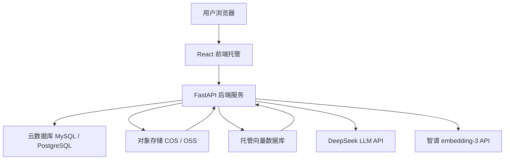

# Enterprise RAG Agent Assistant 中国云生产化架构设计

## 一、文档目的

本文档用于为 Enterprise RAG Agent Assistant 设计一条“真实生产流程模拟”的云架构演进路线。

这不是立即上线生产系统，也不是一次性引入完整企业级基础设施，而是帮助项目从本地 portfolio demo 逐步过渡到更接近真实生产项目的工程形态。目标是系统学习 AI 应用工程中的云架构、数据持久化、对象存储、向量数据库、部署、CORS、安全和成本控制。

项目当前仍定位为 production-minded portfolio project。后续改造会优先考虑中国云平台，并尽量选择便宜、免费额度友好、学习成本可控的方案。

## 二、当前本地架构

当前项目架构如下：

- 前端：React + Vite + TypeScript + Tailwind
- 后端：FastAPI
- 关系数据：SQLite，保存 `documents`、`chunks`、`chat_logs`、`feedback`
- 上传文件：本地 `data/uploads`
- 向量数据库：本地 Chroma，保存 chunk embeddings
- LLM：DeepSeek
- Embedding：智谱 `embedding-3`
- 本地运行：Docker Compose 启动 backend + frontend

当前架构适合本地开发、功能验证和面试演示。它的优点是简单、成本低、容易调试。但它不适合真实生产长期使用，主要原因是：

- SQLite 不适合多实例服务和更复杂的并发访问。
- 本地 `data/uploads` 随容器和机器绑定，迁移、备份和扩容困难。
- 本地 Chroma 适合开发验证，但生产环境需要更稳定的持久化、运维和容量管理。
- 本地 `localhost` CORS 配置无法直接适配线上域名。
- 本地 `.env` 不适合作为云环境的长期配置方式。

## 三、目标生产化架构

目标架构是将本地文件、数据库和向量存储逐步替换为云服务：

```text
React frontend
→ FastAPI backend
→ Cloud Database
→ Object Storage
→ Managed Vector Database
→ LLM API / Embedding API
```



生产化后的核心目标不是堆组件，而是让每类数据进入合适的基础设施：

- 元数据和业务记录进入云数据库。
- 原始上传文件进入对象存储。
- 向量索引进入托管向量数据库。
- 模型能力继续通过外部 API 调用。
- 前端和后端分别部署到云平台，并通过环境变量配置域名、CORS 和密钥。

## 四、核心组件替换关系

| 当前组件 | 生产化替代 | 作用 | 为什么要替换 |
|---|---|---|---|
| SQLite | 云数据库 MySQL / PostgreSQL | 保存 documents、chunks、chat_logs、feedback 等结构化数据 | SQLite 适合本地开发，但不适合多实例、备份、权限、连接管理和长期线上运行 |
| `data/uploads` | OSS / COS | 保存用户上传的原始文档 | 本地文件和机器绑定，云对象存储更适合持久化、备份、权限控制和独立扩容 |
| local Chroma | 托管向量数据库 | 保存 chunk embeddings 并支持向量检索 | 本地向量库运维和迁移成本高，托管服务更适合生产流程模拟 |
| localhost frontend | 前端托管平台 | 托管 React 静态资源或前端服务 | 本地前端只能开发演示，线上需要稳定访问地址和 HTTPS |
| localhost backend | 云应用服务 / 云服务器 | 运行 FastAPI API 服务 | 本地后端不能被外部稳定访问，云服务支持公网访问、环境变量和日志 |
| hardcoded local CORS | 环境变量 `CORS_ORIGINS` | 控制允许访问后端的前端域名 | 线上域名会变化，CORS 不能长期写死在代码中 |
| local `.env` | 云平台环境变量 | 管理 API key、数据库连接、对象存储配置 | 云环境不能依赖本地文件，密钥也不能提交代码仓库 |

## 五、中国云平台选型

### 路线 A：腾讯云优先

- 前端：CloudBase / 静态网站托管
- 后端：CloudBase 云托管 / 轻量应用服务器 / CVM
- 数据库：腾讯云 MySQL / CloudBase 数据库
- 对象存储：腾讯云 COS
- 向量数据库：腾讯云 VectorDB

腾讯云路线更适合便宜起步和统一生态学习。对于当前项目，它的优势是对象存储、数据库、向量数据库和应用托管都在同一生态内，适合做真实 RAG 应用生产流程模拟。

### 路线 B：阿里云备选

- 前端：OSS 静态网站 / 云开发类方案
- 后端：ECS / SAE / 函数计算
- 数据库：RDS MySQL / PostgreSQL
- 对象存储：OSS
- 向量数据库：Milvus 版

阿里云路线更接近传统企业云架构，适合学习 ECS、RDS、OSS、SAE 等常见企业部署组合。它也适合真实生产流程模拟，但初期可能需要理解更多云产品和网络配置。

两条路线都可以用于真实生产流程模拟。区别主要在学习路径和成本控制方式：腾讯云更适合当前项目低成本统一生态起步，阿里云更适合后续理解传统企业云架构。

## 六、推荐主线方案

当前项目推荐采用：

```text
腾讯云主线，阿里云备选。
```

推荐原因：

1. 国内平台，访问和账号体系更贴近中国云部署场景。
2. 便宜或免费资源更适合学习和 portfolio project。
3. COS / 云数据库 / VectorDB 组合完整，覆盖 RAG 应用的核心基础设施。
4. 适合模拟真实 RAG 应用生产架构。
5. 当前阶段不需要过早学习 K8s、复杂 CI/CD、多云架构。

## 七、分阶段生产化改造路线

### 阶段 0：保留当前本地 Docker Compose 作为 baseline

保持当前 backend + frontend 的本地 Docker Compose 启动方式，用它作为所有后续改造的回归基线。

目标：

- 本地能稳定启动。
- 文档上传、RAG 问答、Agent 调度都能跑通。
- 每次云化改造后，都能回到本地 baseline 验证核心业务没有坏。

### 阶段 1：抽象 StorageService，把本地文件存储和对象存储解耦

在不改变上传接口行为的前提下，设计 `StorageService` 抽象，让业务层不直接依赖 `data/uploads`。

目标：

- 当前实现仍然可以是 LocalStorage。
- 后续可以替换为 COSStorage / OSSStorage。
- 文档服务只关心“保存文件并获得文件地址”，不关心底层存在哪里。

### 阶段 2：接入对象存储 COS / OSS，替换 `data/uploads`

优先选择腾讯云 COS 或阿里云 OSS，先从上传文件存储开始云化。

目标：

- 上传文件保存到对象存储。
- 数据库只保存文件 URL、bucket、object key 等元数据。
- 本地容器不再长期保存用户上传文件。

### 阶段 3：将 SQLite 迁移到云数据库 MySQL / PostgreSQL

把 documents、chunks、chat_logs、feedback 等结构化数据迁移到云数据库。

目标：

- 数据库连接通过环境变量配置。
- 本地 SQLite 仍可作为开发模式。
- 云数据库用于模拟线上环境。

### 阶段 4：将本地 Chroma 替换为托管向量数据库

把向量索引从本地 Chroma 迁移到腾讯云 VectorDB 或阿里云 Milvus 版。

目标：

- 后端通过统一 VectorStoreService 调用向量库。
- 文档入库和 RAG 检索逻辑尽量不感知底层向量数据库差异。
- 支持更稳定的持久化、容量管理和后续检索优化。

### 阶段 5：后端部署到中国云平台

将 FastAPI 后端部署到 CloudBase 云托管、轻量应用服务器、CVM、SAE 或 ECS。

目标：

- 后端拥有公网访问地址。
- 环境变量在云平台配置。
- 日志可在云平台查看。
- 后端可以访问云数据库、对象存储和向量数据库。

### 阶段 6：前端部署到中国云平台

将 React 前端部署到 CloudBase 静态托管、COS 静态网站、OSS 静态网站或其他前端托管服务。

目标：

- 前端拥有稳定公网 URL。
- `VITE_API_BASE_URL` 指向线上后端地址。
- 构建产物不包含本地开发地址。

### 阶段 7：线上 CORS、环境变量、日志、安全和成本检查

将 CORS、API key、数据库连接、对象存储密钥等配置从本地写死改为环境变量管理。

目标：

- `CORS_ORIGINS` 支持多个线上前端域名。
- 不提交真实 API key。
- 开启必要日志。
- 检查云资源计费方式。
- 确认对象存储、数据库、向量库权限不过度开放。

### 阶段 8：补充 production gap 和 resume packaging

整理当前项目和真实生产系统之间的差距，并将架构演进过程整理成简历和面试展示材料。

目标：

- 明确说明项目不是 production-ready。
- 展示自己理解真实生产流程。
- 说明本地 demo、云化模拟、后续优化之间的关系。

## 八、每一阶段要学习什么

| 阶段 | 学习重点 |
|---|---|
| 阶段 0：本地 Docker Compose baseline | 理解容器端口映射、前后端联调、CORS、本地数据挂载 |
| 阶段 1：StorageService 抽象 | 理解为什么业务代码不应该直接依赖本地文件路径 |
| 阶段 2：对象存储 | 理解对象存储不是数据库，它适合保存文件对象，不适合复杂查询 |
| 阶段 3：云数据库 | 理解云数据库和 SQLite 在连接、并发、备份、权限和运维上的差异 |
| 阶段 4：托管向量数据库 | 理解向量数据库为什么需要持久化、索引管理、容量管理和检索性能控制 |
| 阶段 5：后端云部署 | 理解后端服务如何暴露公网、读取环境变量、连接云资源 |
| 阶段 6：前端云部署 | 理解前端构建产物、API Base URL、HTTPS 和跨域配置 |
| 阶段 7：线上检查 | 理解环境变量不能写死、CORS 必须按域名配置、日志和权限是生产基本功 |
| 阶段 8：项目包装 | 理解如何诚实表达 portfolio project 和 production-ready 系统之间的差距 |

额外需要持续学习：

- 为什么要控制云资源费用。
- 为什么 API key 需要额度、告警和最小权限。
- 为什么真实生产需要日志、监控、错误追踪和权限边界。
- 为什么数据迁移和 embedding 模型切换必须谨慎处理。

## 九、成本控制策略

生产流程模拟必须把成本控制作为核心约束：

1. 优先使用免费额度、试用资源或学生/新用户优惠。
2. 开通资源前先确认计费方式、规格、地域和是否自动续费。
3. 能按量付费就不轻易包年包月。
4. 测试后及时关闭不用的实例，避免空闲扣费。
5. DeepSeek、智谱等 API key 设置额度、限流或费用告警。
6. 对象存储注意外网下行流量、请求次数和存储容量费用。
7. 向量数据库注意实例规格、空闲费用和最低计费单位。
8. 云数据库注意存储、连接数、备份和公网访问费用。
9. 所有云资源先用最小规格验证流程，再考虑扩容。
10. 定期检查账单，避免“忘记关闭测试资源”带来的隐形成本。

## 十、当前暂时不做的高级内容

当前阶段暂时不做：

- Kubernetes
- Redis
- Celery
- 多 Agent
- MCP
- LangGraph 重构
- 微服务拆分
- 企业级权限系统
- 多租户
- 高并发压测
- 完整 CI/CD

原因：

这些都是后续能力，不适合当前阶段过早引入。当前更重要的是先把 AI 应用主线打稳：文档上传、对象存储、结构化数据、向量检索、模型调用、前后端部署和基础安全配置。

过早引入高级组件会增加调试复杂度，分散对 RAG 生产化核心链路的理解。

## 十一、下一步行动建议

当前不要立刻部署完整线上系统。

下一步建议按以下顺序推进：

1. 检查并改造配置层，让 `CORS_ORIGINS` 支持环境变量。
2. 设计 `StorageService` 接口，把本地文件保存逻辑从业务流程中解耦出来。
3. 选择腾讯云 COS 或阿里云 OSS 作为第一个生产化替换点。
4. 先从“上传文件存到对象存储”开始，而不是一次性改数据库和向量库。

推荐优先做对象存储的原因：

- 文件存储和业务数据库边界清晰。
- 改造范围相对可控。
- 很容易在面试中说明生产化思路。
- 对 RAG 主流程影响小，适合作为第一步云化练习。

## 十二、面试表达

这个项目最初是本地 RAG + Agent Demo，但我没有停留在 Demo 层面，而是按真实生产流程去拆解它。后续我会把本地 SQLite、uploads 和 Chroma 逐步替换为云数据库、对象存储和托管向量数据库，并优先选择中国云平台做低成本生产化模拟。

我不会一开始就引入 Kubernetes、微服务或复杂 CI/CD，而是先从最贴近 RAG 应用生产问题的部分开始：文件上传如何持久化、结构化数据如何迁移到云数据库、向量索引如何托管、前后端部署如何处理 CORS 和环境变量。这样既能保持项目可运行，也能逐步贴近真实 AI 应用工程流程。
